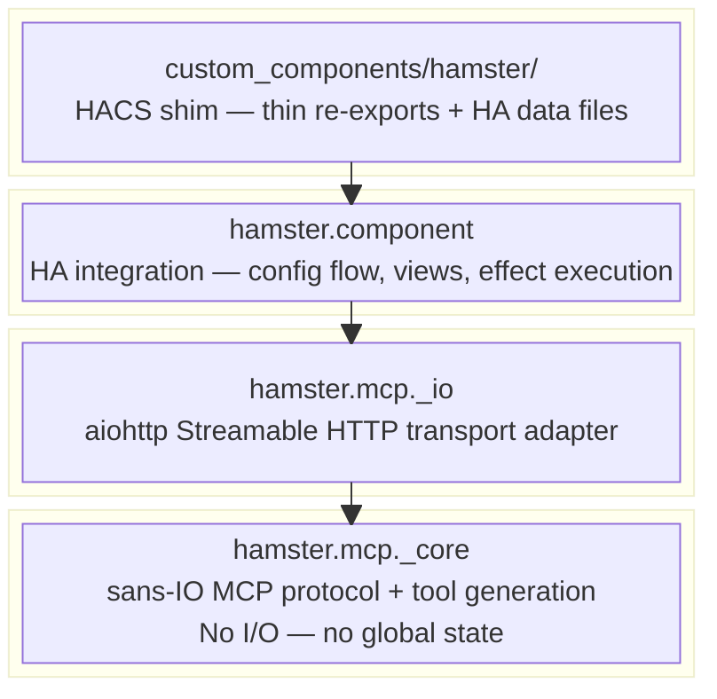
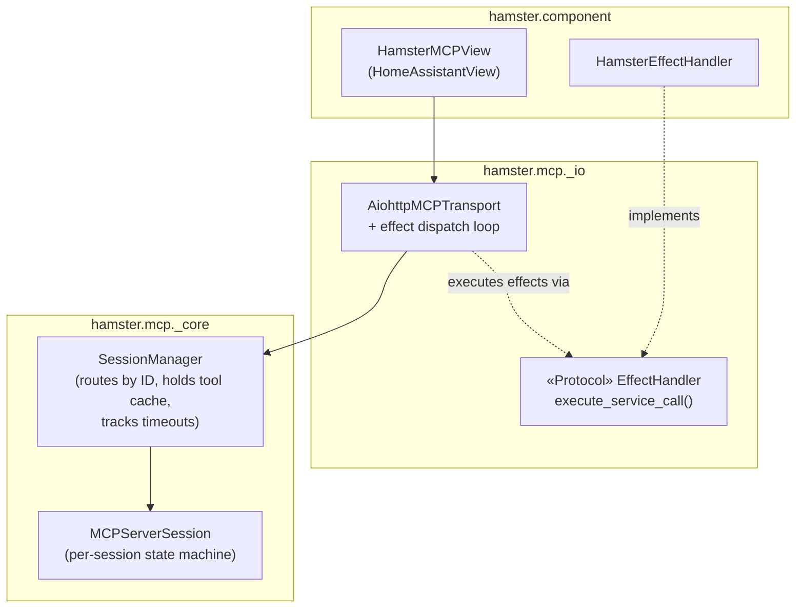

# Architecture

## Layer Design



See [Data Flow](data-flow.md) for sequence diagrams showing how MCP requests
flow through each layer.

## Package Layout

```text
hamster/
├── src/
│   └── hamster/
│       ├── __init__.py
│       ├── mcp/                          # MCP protocol submodule
│       │   ├── __init__.py               # Public API re-exports
│       │   ├── _core/                    # Sans-IO protocol core
│       │   │   ├── __init__.py
│       │   │   ├── events.py             # Protocol events + tool effect/continuation types
│       │   │   ├── session.py            # SessionManager + MCPServerSession
│       │   │   ├── jsonrpc.py            # JSON-RPC 2.0 parsing/building
│       │   │   ├── tools.py              # Tool generation, call_tool(), resume()
│       │   │   └── types.py              # MCP data types (Tool, Content, etc.)
│       │   ├── _io/                      # I/O adapters
│       │   │   ├── __init__.py
│       │   │   └── aiohttp.py            # aiohttp Streamable HTTP transport
│       │   └── _tests/
│       │       └── ...
│       └── component/                    # HA custom component
│           ├── __init__.py               # async_setup_entry, async_unload_entry
│           ├── config_flow.py            # Config + options flows
│           ├── const.py                  # DOMAIN, defaults
│           ├── http.py                   # HomeAssistantView + HamsterEffectHandler
│           └── _tests/
│               └── ...
├── custom_components/
│   └── hamster/                          # HACS deployment shim
│       ├── __init__.py                   # Re-exports from hamster.component
│       ├── config_flow.py                # Re-exports
│       ├── manifest.json
│       ├── strings.json
│       └── translations/en.json
├── docs/
│   ├── mkdocs.yml
│   └── src/
├── hacs.json
├── brand/icon.png
├── pyproject.toml
├── mise.toml
├── .pre-commit-config.yaml
├── AGENTS.md
├── README.md
├── LICENSE-MIT
└── LICENSE-APACHE
```

## Module Descriptions

| Module | Layer | Purpose |
| --- | --- | --- |
| `hamster.mcp._core.types` | Core | MCP data types: `Tool`, `Content`, `ServerInfo`, `ServerCapabilities` |
| `hamster.mcp._core.jsonrpc` | Core | JSON-RPC 2.0 message parsing and response building |
| `hamster.mcp._core.events` | Core | `ReceiveResult` variants (`Initialized`, `ToolListResponse`, `ToolCallStarted`, `ProtocolError`, etc.) and tool effect/continuation types (`Done`, `ServiceCall`, `FormatServiceResponse`) |
| `hamster.mcp._core.session` | Core | `SessionManager` --- multi-session container; routes by session ID, creates sessions via injected `session_id_factory`, tracks timeouts. `MCPServerSession` --- per-session sans-IO state machine. |
| `hamster.mcp._core.tools` | Core | Pure tool generation (`services_to_mcp_tools`), `call_tool()`, `resume()` |
| `hamster.mcp._io.aiohttp` | Integration | `AiohttpMCPTransport` --- bridges aiohttp requests to `SessionManager`, runs effect dispatch loop. Timeout wakeup loop. `EffectHandler` protocol definition. |
| `hamster.component` | Application | HA integration entry point (`async_setup_entry`, `async_unload_entry`) |
| `hamster.component.config_flow` | Application | Config flow (setup) + options flow (tristate control) |
| `hamster.component.http` | Application | `HamsterMCPView` --- `HomeAssistantView` subclass, wires transport + HA auth. `HamsterEffectHandler` --- implements `EffectHandler`, executes `hass.services.async_call()`. |
| `hamster.component.const` | Application | Domain constant, defaults |
| `custom_components/hamster/` | Deployment | HACS shim --- thin re-exports so HA can discover the integration |

## Core API: `ReceiveResult`

`SessionManager.receive_message()` returns a discriminated union describing
what the transport should do next.
Protocol-level results (initialization, errors) include pre-built JSON-RPC
responses.
Application-level results (tool calls) include effect objects for the
transport to execute.

```python
# All in _core

@dataclass(frozen=True)
class Initialized:
    """New session created. Send JSON-RPC response + Mcp-Session-Id header."""
    session_id: str
    response: dict

@dataclass(frozen=True)
class NotificationAcked:
    """Notification processed. Send HTTP 202, no body."""
    pass

@dataclass(frozen=True)
class ToolListResponse:
    """Tool list ready. Send complete JSON-RPC response."""
    response: dict

@dataclass(frozen=True)
class ToolCallStarted:
    """Tool call initiated. Transport must run the effect dispatch loop."""
    request_id: JsonRpcId
    effect: ToolEffect

@dataclass(frozen=True)
class ProtocolError:
    """Protocol-level error. Send pre-built JSON-RPC error response."""
    response: dict
    http_status: int

ReceiveResult = (
    Initialized | NotificationAcked | ToolListResponse
    | ToolCallStarted | ProtocolError
)
```

The transport dispatch is a simple match/case --- see
[Data Flow](data-flow.md) for the full sequence diagrams.

## Effect Handler Protocol

The only I/O the transport cannot perform itself is executing HA service
calls.
The `EffectHandler` protocol defines this narrow boundary.
The transport is HA-independent for testability; the component provides the
implementation.



Defined in `hamster.mcp._io`, implemented by `hamster.component`:

```python
class EffectHandler(Protocol):
    async def execute_service_call(
        self, domain: str, service: str, data: dict[str, object],
    ) -> ServiceCallResult: ...
```

### Responsibility Split

| Concern | Owner | Layer |
| --- | --- | --- |
| HTTP header extraction | Transport | `_io` |
| JSON body parsing | Transport | `_io` |
| HTTP response construction | Transport | `_io` |
| Effect dispatch loop | Transport | `_io` |
| Timeout wakeup loop | Transport | `_io` |
| JSON-RPC parsing + response building | MCPServerSession | `_core` |
| Session state machine | MCPServerSession | `_core` |
| Session routing + creation | SessionManager | `_core` |
| Session timeout tracking | SessionManager | `_core` |
| Tool list caching + responses | SessionManager | `_core` |
| `call_tool()` / `resume()` | `_core.tools` | `_core` |
| HA service call execution | **EffectHandler** | `component` |
| Tool list generation trigger | Component | `component` |

### Error Handling Layers

Each layer handles its own error class:

| Error | Who handles | Result |
| --- | --- | --- |
| Malformed JSON, bad headers | **Transport** | HTTP 400 via `jsonrpc` helpers |
| Unknown session ID | **SessionManager** | `ProtocolError(http_status=404)` |
| Missing session ID after init | **SessionManager** | `ProtocolError(http_status=400)` |
| Wrong state, unknown method | **MCPServerSession** | `ProtocolError` with JSON-RPC error code |
| Invalid JSON-RPC structure | **MCPServerSession** | `ProtocolError` with `-32600` |
| HA service call exception | **EffectHandler** | `ServiceCallResult` with error; `resume()` produces `Done(isError=True)` |

Protocol errors never escape the core.
Application errors never escape the handler.
The transport just does match/case.

## Distribution

The project produces two artifacts from a single repository:

| Artifact | Mechanism | Contains |
| --- | --- | --- |
| `hamster` on PyPI | `pip install hamster` | `hamster.mcp` + `hamster.component` (the library) |
| `custom_components/hamster/` via HACS | HACS git clone | Thin shim files + `manifest.json` + UI strings |

The `manifest.json` declares `"requirements": ["hamster>=0.1.0"]`, so when HA
loads the custom component it automatically pip-installs the library.

## Why a Custom Component

The decision to build as a custom component (not an external server or add-on)
was driven by one critical capability: only code running inside HA can access
`hass.services.async_services()`, which returns service schemas with field
definitions.

The external REST API (`/api/services`) lists services but does **not** include
schemas.
The WebSocket API may include some schema info but is less complete.

Additional benefits:

- Built-in HA auth via `requires_auth=True` on `HomeAssistantView`
- Direct access to entity/device/area registries
- Access to `async_should_expose()` for respecting HA's entity exposure settings
- Single deployment (no separate server process)
- No network hop for API calls

Trade-offs accepted:

- HA restart required for code changes (slower dev iteration)
- Must use HA's Python version and not conflict with HA's pinned dependencies
- Runs in HA's event loop (bugs could impact HA stability)

## Existing HA MCP Landscape

| Project | Type | Tools | Discovery | Auth |
| --- | --- | --- | --- | --- |
| `mcp_server` (official) | Core component | ~20 | Dynamic via intents | OAuth |
| `ha-mcp` (community) | Standalone/add-on | 95+ | Static | Token |
| `hass-mcp-server` (ganhammar) | Custom component | 21 | Static | OAuth |
| `mcp-assist` | Custom component | 11 | Index pattern | IP whitelist |
| **Hamster** | Custom component | All HA services | **Dynamic from schemas** | HA built-in |

Hamster's unique position: dynamic tool generation from service schemas, built-in
HA auth, full admin access, tristate tool control.
No existing project combines all of these.
