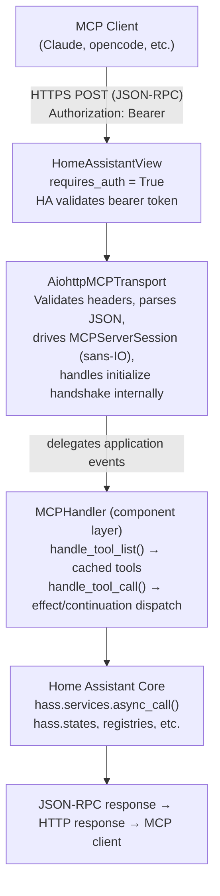
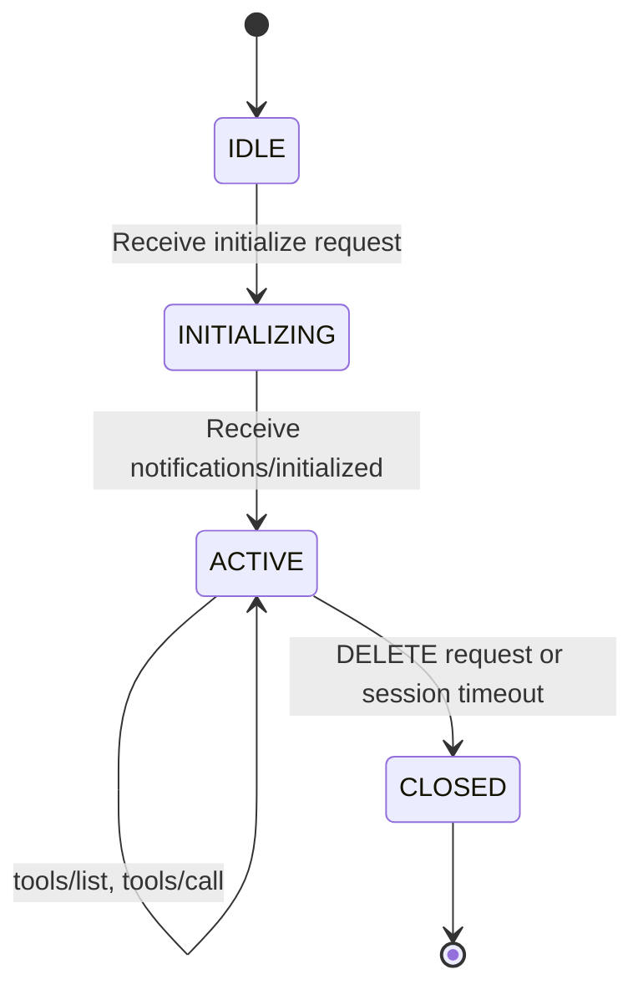
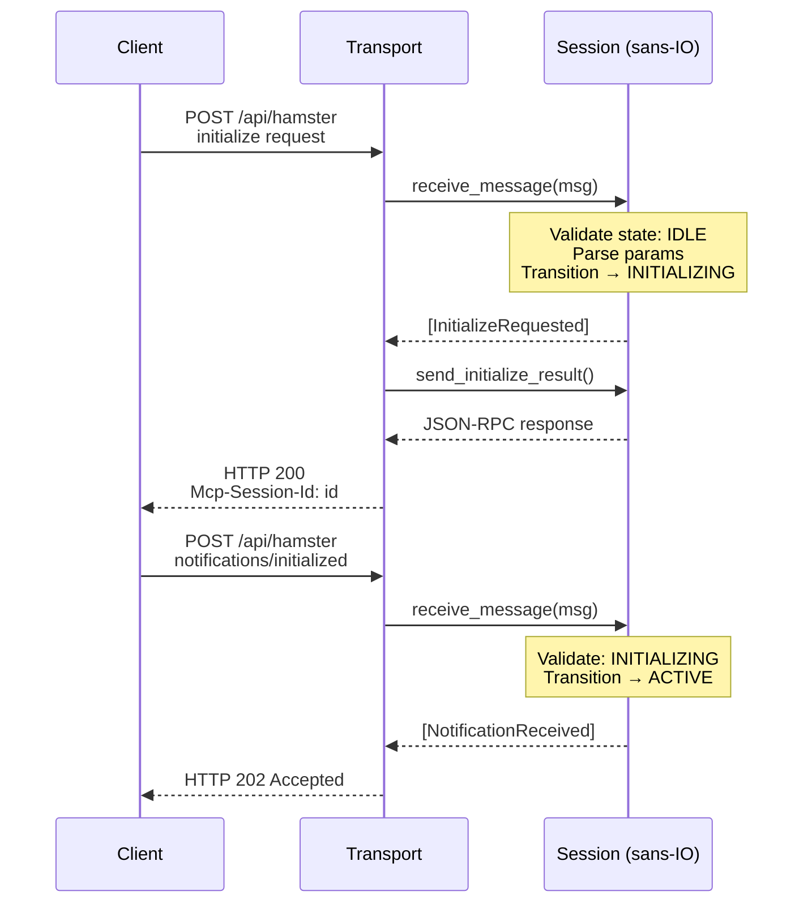
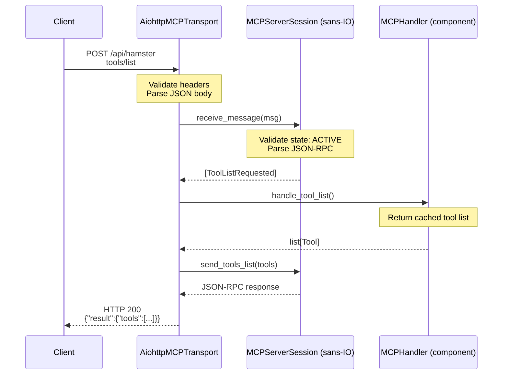
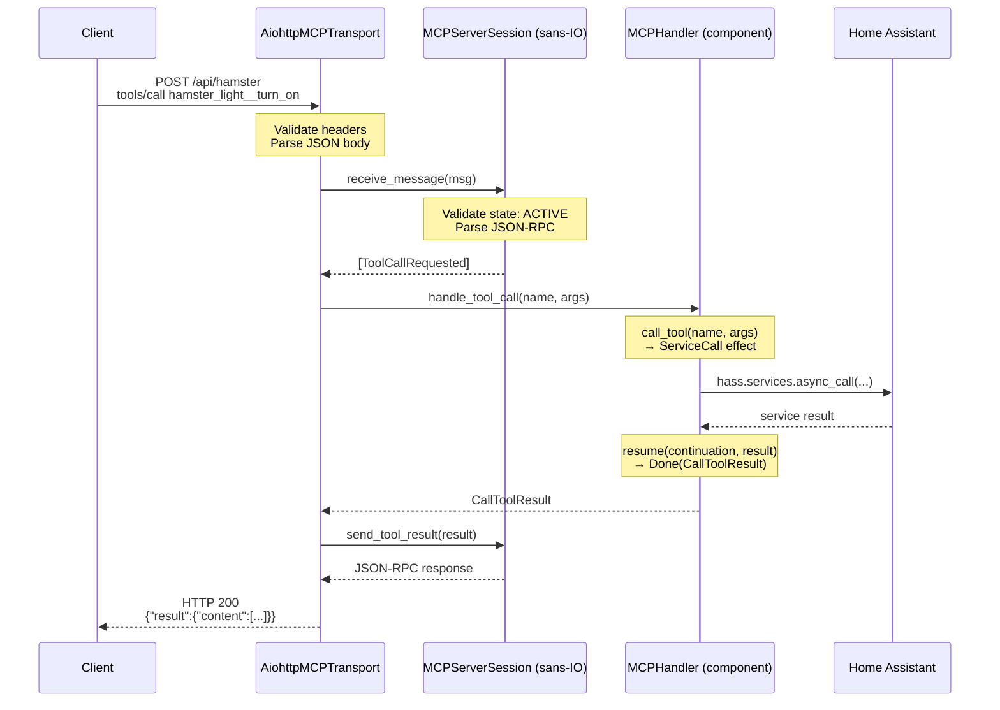
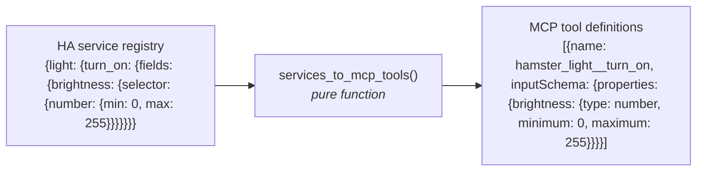

# Data Flow

This page describes how MCP requests flow through the system, from an external
MCP client down to Home Assistant service calls and back.
For the MCP protocol details see [MCP Protocol](mcp-protocol.md); for tool
generation specifics see [Tool Generation](tool-generation.md).

## Overview

## Session Lifecycle

The MCP protocol requires a handshake before normal operation.
The sans-IO session enforces this via a state machine.

Messages received in the wrong state produce a JSON-RPC error response.
The session never performs I/O --- it only validates and emits events.

## Initialization Flow

## Tool List Flow

The tool list is generated once at integration load time and cached.
It is regenerated when `EVENT_SERVICE_REGISTERED` or `EVENT_SERVICE_REMOVED`
fires.
The transport delegates to the handler, which returns the cached list.

## Tool Call Flow (with Effect/Continuation)

For tool calls that require I/O (most do --- they call HA services), the
handler uses the effect/continuation dispatch loop internally.
The transport delegates via `MCPHandler` and receives a finished result.

## Tool Generation (Pure Function)

The `services_to_mcp_tools()` function is pure --- it has no I/O dependencies.
The I/O layer calls `hass.services.async_services()` and feeds the result in.

The tristate configuration is also passed in as data --- the function filters
based on Enabled/Dynamic/Disabled state per service.
