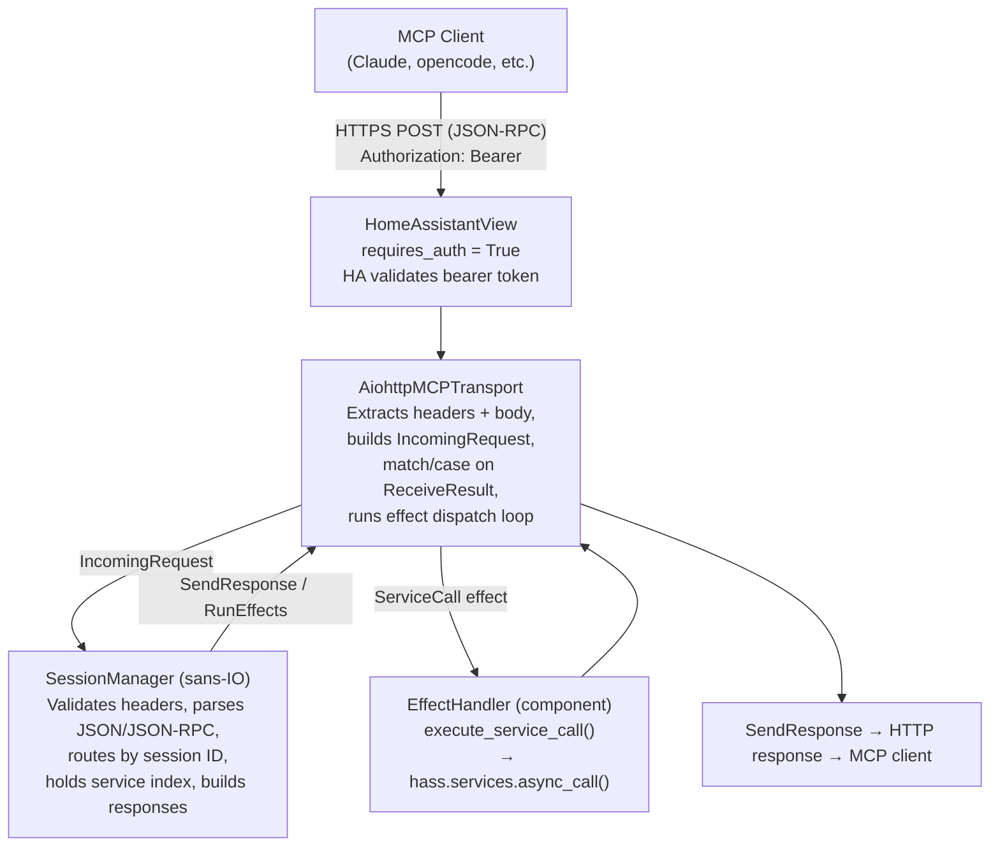
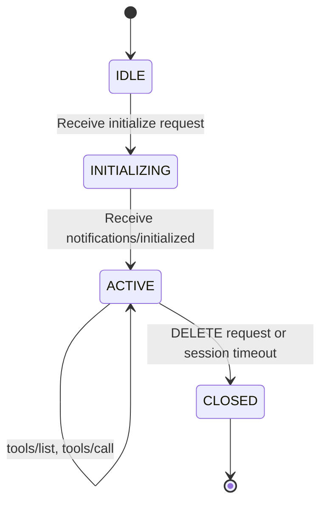
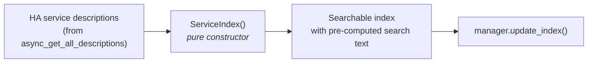

# Data Flow

This page describes how MCP requests flow through the system, from an external
MCP client down to Home Assistant service calls and back.
For the MCP protocol details see [MCP Protocol](mcp-protocol.md); for tool
generation specifics see [Tool Generation](tool-generation.md).

## Overview



## Session Lifecycle

The MCP protocol requires a handshake before normal operation.
The sans-IO session enforces this via a state machine.



Messages received in the wrong state produce a JSON-RPC error response.
The `SessionManager` routes requests to sessions by `Mcp-Session-Id` and
creates new sessions on `initialize` via an injected `session_id_factory`.
Neither the manager nor individual sessions perform I/O --- they only
validate and emit events.

## Initialization Flow

```mermaid
sequenceDiagram
    participant Client
    participant Transport as AiohttpMCPTransport
    participant Manager as SessionManager (sans-IO)

    Client->>Transport: POST /api/hamster_mcp<br/>initialize request (no session ID)
    Note over Transport: Read body bytes<br/>Build IncomingRequest
    Transport->>Manager: receive_request(IncomingRequest, now)
    Note over Manager: Validate headers, parse JSON,<br/>parse JSON-RPC<br/>No session ID → create new session<br/>via session_id_factory<br/>Transition → INITIALIZING
    Manager-->>Transport: SendResponse(200, {Mcp-Session-Id: id}, body)
    Note over Transport: Translate to HTTP response
    Transport-->>Client: HTTP 200<br/>Mcp-Session-Id: &lt;id&gt;

    Client->>Transport: POST /api/hamster_mcp<br/>notifications/initialized<br/>Mcp-Session-Id: &lt;id&gt;
    Note over Transport: Build IncomingRequest
    Transport->>Manager: receive_request(IncomingRequest, now)
    Note over Manager: Validate, parse, look up session<br/>Transition → ACTIVE
    Manager-->>Transport: SendResponse(202, {}, None)
    Transport-->>Client: HTTP 202 Accepted
```

## Tool List Flow

The tool list is constant --- 4 fixed meta-tools defined in
`hamster_mcp.mcp._core.tools.TOOLS`.  The `SessionManager` always returns the
same list.  No regeneration is needed when services change (only the
`ServiceIndex` is rebuilt).

```mermaid
sequenceDiagram
    participant Client
    participant Transport as AiohttpMCPTransport
    participant Manager as SessionManager (sans-IO)

    Client->>Transport: POST /api/hamster_mcp<br/>tools/list<br/>Mcp-Session-Id: &lt;id&gt;
    Note over Transport: Build IncomingRequest
    Transport->>Manager: receive_request(IncomingRequest, now)
    Note over Manager: Validate headers, parse JSON/JSON-RPC<br/>Look up session by ID<br/>Validate state: ACTIVE<br/>Build response from constant TOOLS
    Manager-->>Transport: SendResponse(200, headers, body)
    Note over Transport: Translate to HTTP response
    Transport-->>Client: HTTP 200<br/>{"result":{"tools":[4 meta-tools]}}
```

## Tool Call Flow (with Effect/Continuation)

The core dispatches by tool name via `call_tool()`.  For the three
pure tools (`search`, `explain`, `schema`), `call_tool()` returns
`Done` immediately --- no I/O needed.  For `hamster_services_call`,
it returns a `ServiceCall` effect that the transport executes.

### Pure tools (search, explain, schema)

```mermaid
sequenceDiagram
    participant Client
    participant Transport as AiohttpMCPTransport
    participant Manager as SessionManager (sans-IO)

    Client->>Transport: POST /api/hamster_mcp<br/>tools/call hamster_services_search<br/>Mcp-Session-Id: &lt;id&gt;
    Note over Transport: Build IncomingRequest
    Transport->>Manager: receive_request(IncomingRequest, now)
    Note over Manager: Validate, parse, look up session<br/>call_tool(name, args, index)<br/>→ Done(CallToolResult)
    Manager-->>Transport: RunEffects(request_id, Done)

    Note over Transport: Effect dispatch loop<br/>Done → return result immediately
    Transport->>Manager: build_effect_response(request_id, result)
    Manager-->>Transport: SendResponse(200, headers, body)
    Transport-->>Client: HTTP 200<br/>{"result":{"content":[{"type":"text","text":"..."}]}}
```

### Service call tool

```mermaid
sequenceDiagram
    participant Client
    participant Transport as AiohttpMCPTransport
    participant Manager as SessionManager (sans-IO)
    participant Effect as EffectHandler (component)

    Client->>Transport: POST /api/hamster_mcp<br/>tools/call hamster_services_call<br/>Mcp-Session-Id: &lt;id&gt;
    Note over Transport: Build IncomingRequest
    Transport->>Manager: receive_request(IncomingRequest, now)
    Note over Manager: Validate, parse, look up session<br/>call_tool(name, args, index)<br/>→ ServiceCall(domain, service, target, data)
    Manager-->>Transport: RunEffects(request_id, ServiceCall)

    Note over Transport: Effect dispatch loop
    Transport->>Effect: execute_service_call(domain, service, target, data)
    Note over Effect: hass.services.async_call(...)
    Effect-->>Transport: ServiceCallResult
    Note over Transport: resume(continuation, result)<br/>→ Done(CallToolResult)
    Transport->>Manager: build_effect_response(request_id, result)
    Manager-->>Transport: SendResponse(200, headers, body)
    Note over Transport: Translate to HTTP response
    Transport-->>Client: HTTP 200<br/>{"result":{"content":[...]}}
```

## Service Index (Pure Construction)

The `ServiceIndex` class lives in `hamster_mcp.mcp._core.tools` --- its
constructor is pure (no I/O, no global state).  The component layer
calls `async_get_all_descriptions(hass)` and feeds the result in, then
updates the `SessionManager`'s index:

```python
# In component — on startup and on EVENT_SERVICE_REGISTERED/REMOVED
descriptions = await async_get_all_descriptions(hass)
index = ServiceIndex(descriptions)
manager.update_index(index)
```



The tool list itself is constant --- `TOOLS` is a tuple of 4 fixed `Tool`
definitions that never changes.
