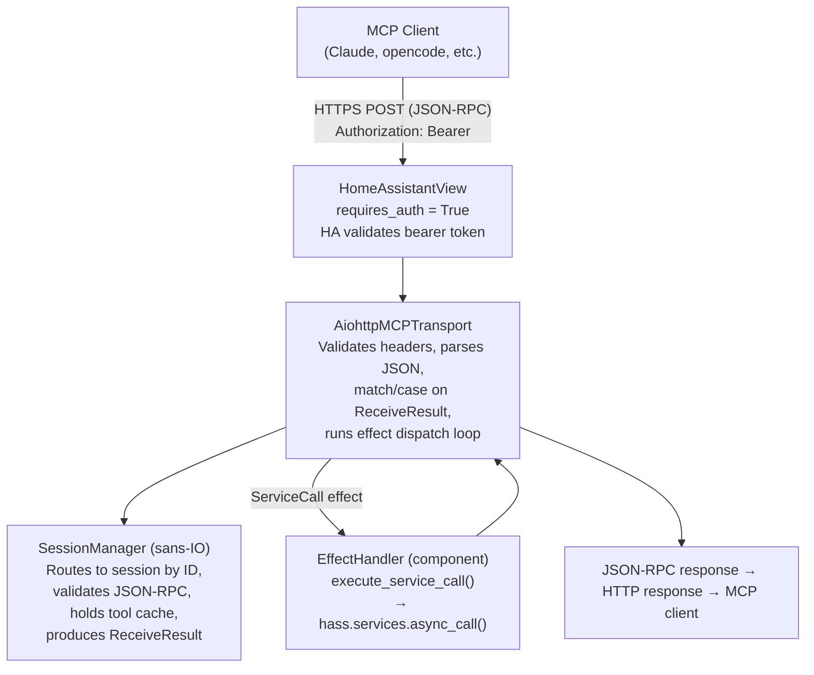
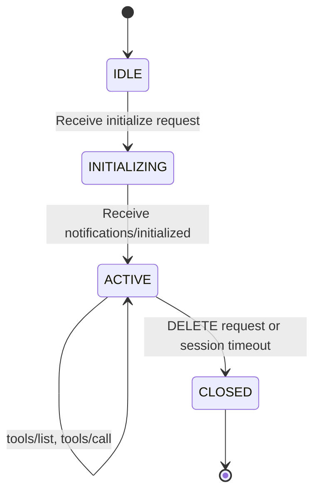
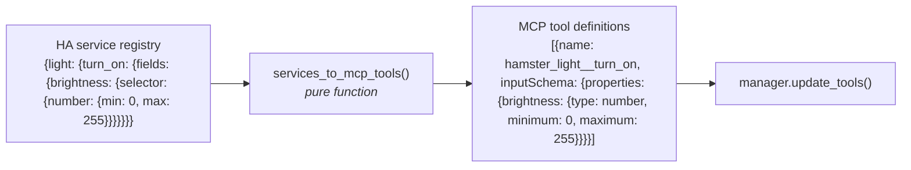

# Data Flow

This page describes how MCP requests flow through the system, from an external
MCP client down to Home Assistant service calls and back.
For the MCP protocol details see [MCP Protocol](mcp-protocol.md); for tool
generation specifics see [Tool Generation](tool-generation.md).

## Overview



## Session Lifecycle

The MCP protocol requires a handshake before normal operation.
The sans-IO session enforces this via a state machine.



Messages received in the wrong state produce a JSON-RPC error response.
The `SessionManager` routes requests to sessions by `Mcp-Session-Id` and
creates new sessions on `initialize` via an injected `session_id_factory`.
Neither the manager nor individual sessions perform I/O --- they only
validate and emit events.

## Initialization Flow

```mermaid
sequenceDiagram
    participant Client
    participant Transport as AiohttpMCPTransport
    participant Manager as SessionManager (sans-IO)

    Client->>Transport: POST /api/hamster<br/>initialize request (no session ID)
    Note over Transport: Validate headers<br/>Parse JSON body
    Transport->>Manager: receive_message(None, msg, now)
    Note over Manager: No session ID → create new session<br/>via session_id_factory<br/>Validate JSON-RPC, transition → INITIALIZING
    Manager-->>Transport: Initialized(session_id, response)
    Note over Transport: Send pre-built JSON-RPC response<br/>+ Mcp-Session-Id header
    Transport-->>Client: HTTP 200<br/>Mcp-Session-Id: &lt;id&gt;

    Client->>Transport: POST /api/hamster<br/>notifications/initialized<br/>Mcp-Session-Id: &lt;id&gt;
    Transport->>Manager: receive_message(&lt;id&gt;, msg, now)
    Note over Manager: Look up session by ID<br/>Transition → ACTIVE
    Manager-->>Transport: NotificationAcked()
    Transport-->>Client: HTTP 202 Accepted
```

## Tool List Flow

The tool list is generated once at integration load time and cached in the
`SessionManager`.
It is regenerated when `EVENT_SERVICE_REGISTERED` or `EVENT_SERVICE_REMOVED`
fires (the component calls `manager.update_tools()`).
The core builds the complete JSON-RPC response --- no handler call needed.

```mermaid
sequenceDiagram
    participant Client
    participant Transport as AiohttpMCPTransport
    participant Manager as SessionManager (sans-IO)

    Client->>Transport: POST /api/hamster<br/>tools/list<br/>Mcp-Session-Id: &lt;id&gt;
    Note over Transport: Validate headers<br/>Parse JSON body
    Transport->>Manager: receive_message(&lt;id&gt;, msg, now)
    Note over Manager: Look up session by ID<br/>Validate state: ACTIVE<br/>Parse JSON-RPC<br/>Build response from cached tool list
    Manager-->>Transport: ToolListResponse(response)
    Note over Transport: Send pre-built JSON-RPC response
    Transport-->>Client: HTTP 200<br/>{"result":{"tools":[...]}}
```

## Tool Call Flow (with Effect/Continuation)

The core parses the tool name, calls `call_tool()`, and returns the first
`ToolEffect` inside a `ToolCallStarted` result.
The transport runs the effect dispatch loop, calling the `EffectHandler`
for each I/O effect and `resume()` (a pure `_core` function) to advance
to the next effect.

```mermaid
sequenceDiagram
    participant Client
    participant Transport as AiohttpMCPTransport
    participant Manager as SessionManager (sans-IO)
    participant Effect as EffectHandler (component)

    Client->>Transport: POST /api/hamster<br/>tools/call hamster_light__turn_on<br/>Mcp-Session-Id: &lt;id&gt;
    Note over Transport: Validate headers<br/>Parse JSON body
    Transport->>Manager: receive_message(&lt;id&gt;, msg, now)
    Note over Manager: Look up session by ID<br/>Validate state: ACTIVE<br/>Parse JSON-RPC<br/>call_tool(name, args) → ServiceCall
    Manager-->>Transport: ToolCallStarted(request_id, ServiceCall)

    Note over Transport: Effect dispatch loop
    Transport->>Effect: execute_service_call(domain, service, data)
    Note over Effect: hass.services.async_call(...)
    Effect-->>Transport: ServiceCallResult
    Note over Transport: resume(continuation, result)<br/>→ Done(CallToolResult)<br/>Build JSON-RPC response via jsonrpc
    Transport-->>Client: HTTP 200<br/>{"result":{"content":[...]}}
```

## Tool Generation (Pure Function)

The `services_to_mcp_tools()` function lives in `hamster.mcp._core.tools` ---
it is pure (no I/O, no global state).
The component layer calls `hass.services.async_services()` and feeds the
result in, then updates the `SessionManager`'s cache:

```python
# In component — on startup and on EVENT_SERVICE_REGISTERED/REMOVED
services = await hass.services.async_services()
tools = services_to_mcp_tools(services, tristate_config)
manager.update_tools(tools)
```



The tristate configuration is also passed in as data --- the function filters
based on Enabled/Dynamic/Disabled state per service.
