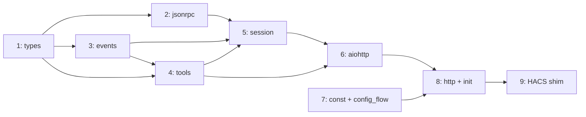
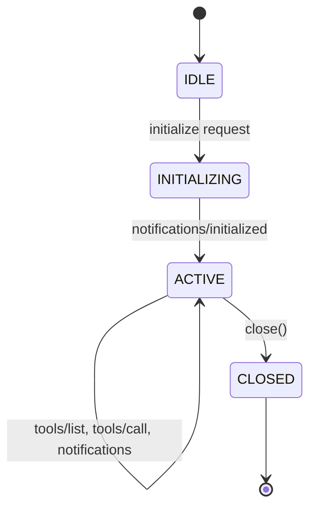

# Implementation Plan

Staged bottom-up implementation following the dependency graph through the
four layers: Core, Integration, Application, Deployment.

## Overview

| Stage | Module(s) | Layer | Deliverable |
| --- | --- | --- | --- |
| **1** | `_core/types.py` | Core | MCP data types, `IncomingRequest` |
| **2** | `_core/jsonrpc.py` | Core | JSON-RPC 2.0 parsing and response building |
| **3** | `_core/events.py` | Core | `SendResponse`/`RunEffects` result types, tool effect/continuation types |
| **4** | `_core/tools.py` | Core | Tool generation, `call_tool()`, `resume()` |
| **5** | `_core/session.py` | Core | `SessionManager` (HTTP-to-protocol pipeline) + `MCPServerSession` state machine |
| **6** | `_io/aiohttp.py` | Integration | Thin aiohttp adapter, `EffectHandler` protocol, effect dispatch loop |
| **7** | `component/const.py`, `component/config_flow.py` | Application | Domain constant, config flow, test infra |
| **8** | `component/http.py`, `component/__init__.py` | Application | HTTP view, effect handler, entry points |
| **9** | `custom_components/hamster/` | Deployment | Activate HACS shim re-exports |

Stages 1--5 are pure Python (no mocks, no event loops).
Stage 6 needs asyncio/aiohttp but no HA.
Stages 7--8 need `pytest-homeassistant-custom-component`.



---

## Stage 1 --- `_core/types.py`

MCP data types.  Frozen dataclasses with no behavior, no I/O, no
serialization logic.

### Types

**`JsonRpcId`** --- type alias `int | str`.  JSON-RPC allows integer or
string request IDs.

**`TextContent`** --- frozen dataclass.

| Field | Type |
| --- | --- |
| `text` | `str` |

No `type` field --- `isinstance()` discriminates.
The `"type": "text"` wire-format key is added by `jsonrpc.py`.

**`ImageContent`** --- frozen dataclass.

| Field | Type |
| --- | --- |
| `data` | `str` (base64-encoded) |
| `mime_type` | `str` |

**`Content`** --- type alias `TextContent | ImageContent`.

**`Tool`** --- frozen dataclass.

| Field | Type | Notes |
| --- | --- | --- |
| `name` | `str` | e.g. `hamster_light__turn_on` |
| `description` | `str` | From HA service schema |
| `input_schema` | `dict[str, object]` | JSON Schema object |

**`CallToolResult`** --- frozen dataclass.

| Field | Type | Default |
| --- | --- | --- |
| `content` | `tuple[Content, ...]` | |
| `is_error` | `bool` | `False` |

`tuple` not `list` --- enforces immutability on a frozen dataclass.

**`ServerInfo`** --- frozen dataclass.

| Field | Type |
| --- | --- |
| `name` | `str` |
| `version` | `str` |

**`ServerCapabilities`** --- frozen dataclass.

| Field | Type | Default |
| --- | --- | --- |
| `tools` | `bool` | `True` |

`tools=True` means "we support tools".
`jsonrpc.py` serializes this to `{"tools": {}}` on the wire.

**`ServiceCallResult`** --- frozen dataclass.
Returned by `EffectHandler.execute_service_call()`, consumed by
`resume()`.

| Field | Type | Default |
| --- | --- | --- |
| `success` | `bool` | |
| `data` | `dict[str, object] \| None` | `None` |
| `error` | `str \| None` | `None` |

**`IncomingRequest`** --- frozen dataclass.
Framework-agnostic representation of an HTTP request.  The transport
extracts these fields from the framework's request object and passes
the struct to the sans-IO core, which handles all validation, parsing,
and routing.

| Field | Type | Notes |
| --- | --- | --- |
| `http_method` | `str` | `"POST"`, `"GET"`, or `"DELETE"` |
| `content_type` | `str \| None` | From `Content-Type` header |
| `accept` | `str \| None` | From `Accept` header |
| `origin` | `str \| None` | From `Origin` header |
| `session_id` | `str \| None` | From `Mcp-Session-Id` header |
| `body` | `bytes` | Raw request body |

### Design decisions

- All frozen dataclasses --- immutable, inspectable, aligned with
  "effects are data" principle.
- Pythonic field names (`input_schema`, `is_error`, `mime_type`) ---
  `jsonrpc.py` handles camelCase conversion for wire format.
- No serialization methods --- wire format conversion lives in
  `jsonrpc.py`.
- `ImageContent` included now --- trivial, avoids a future union change.
- `IncomingRequest` pushes the sans-IO boundary out to raw HTTP data.
  The transport's only async job is reading the request body bytes;
  everything else (header validation, JSON parsing, JSON-RPC parsing,
  session routing, response building) lives in the pure core.

### Tests --- `_tests/test_types.py`

- Construction of each type with valid data.
- Immutability enforcement (assigning to fields raises
  `FrozenInstanceError`).
- `Content` union accepts both `TextContent` and `ImageContent`.
- `CallToolResult` defaults (`is_error=False`).
- `ServiceCallResult` construction for success and error cases.
- `IncomingRequest` construction with all fields.

---

## Stage 2 --- `_core/jsonrpc.py`

JSON-RPC 2.0 message parsing and response building, including MCP type
serialization.

### Parsed message types

**`JsonRpcRequest`** --- frozen dataclass.

| Field | Type |
| --- | --- |
| `id` | `JsonRpcId` |
| `method` | `str` |
| `params` | `dict[str, object]` |

**`JsonRpcNotification`** --- frozen dataclass.

| Field | Type |
| --- | --- |
| `method` | `str` |
| `params` | `dict[str, object]` |

**`JsonRpcParseError`** --- frozen dataclass.

| Field | Type |
| --- | --- |
| `response` | `dict[str, object]` (pre-built JSON-RPC error response) |

**`ParsedMessage`** --- type alias
`JsonRpcRequest | JsonRpcNotification | JsonRpcParseError`.

### Constants

```python
PARSE_ERROR = -32700
INVALID_REQUEST = -32600
METHOD_NOT_FOUND = -32601
INVALID_PARAMS = -32602
INTERNAL_ERROR = -32603

MCP_PROTOCOL_VERSION = "2025-03-26"
```

### Parsing

**`parse_message(raw: dict[str, object]) -> ParsedMessage`**

Validation rules:

- `jsonrpc` must be `"2.0"` --- `INVALID_REQUEST` if missing/wrong.
- `method` must be a string --- `INVALID_REQUEST` if missing/wrong type.
- `params` must be a dict if present (MCP uses only object params) ---
  `INVALID_REQUEST` if wrong type; defaults to `{}` if absent.
- `params: null` treated as `{}`.
- Has `id` (int or str) --- `JsonRpcRequest`; no `id` ---
  `JsonRpcNotification`.
- Non-int/non-str `id` --- `JsonRpcParseError`.
- Error response `id` is `null` when original ID could not be extracted,
  otherwise carries the extracted ID.

### Response building

**`make_success_response(request_id: JsonRpcId, result: object) -> dict`**
--- `{"jsonrpc": "2.0", "id": ..., "result": ...}`.

**`make_error_response(request_id: JsonRpcId | None, code: int, message: str) -> dict`**
--- `{"jsonrpc": "2.0", "id": ..., "error": {"code": ..., "message": ...}}`.

### MCP type serialization

| Function | Wire format |
| --- | --- |
| `serialize_tool(Tool)` | `{"name": ..., "description": ..., "inputSchema": ...}` |
| `serialize_content(Content)` | `{"type": "text", "text": ...}` or `{"type": "image", "data": ..., "mimeType": ...}` |
| `serialize_call_tool_result(CallToolResult)` | `{"content": [...]}` --- `"isError"` key omitted when false, included when true |
| `serialize_server_info(ServerInfo)` | `{"name": ..., "version": ...}` |
| `serialize_capabilities(ServerCapabilities)` | `{"tools": {}}` when true, `{}` when false |

### MCP response builders

| Function | Purpose |
| --- | --- |
| `build_initialize_response(request_id, server_info, capabilities)` | Full init response with `protocolVersion` |
| `build_tool_list_response(request_id, tools: Sequence[Tool])` | Response with serialized tool array (no pagination --- all tools in one response; cursor support deferred) |
| `build_tool_result_response(request_id, result: CallToolResult)` | Response with serialized call tool result |

### Tests --- `_tests/test_jsonrpc.py`

**Parsing:**

- Valid request with id, method, params --- `JsonRpcRequest`.
- Valid notification (no id) --- `JsonRpcNotification`.
- Missing `jsonrpc` / wrong version / missing `method` / non-string
  method / array params / non-int non-str id --- all `JsonRpcParseError`.
- Missing params defaults to `{}`.
- `params: null` treated as `{}`.
- Error response ID is `null` when original could not be extracted.

**Serialization:**

- `TextContent` --- `{"type": "text", "text": "..."}`.
- `ImageContent` --- `{"type": "image", "data": "...", "mimeType": "..."}`.
- `Tool` --- camelCase `inputSchema`.
- `CallToolResult(is_error=False)` --- `isError` key absent.
- `CallToolResult(is_error=True)` --- `"isError": true`.
- `ServerCapabilities(tools=True)` --- `{"tools": {}}`.
- `ServerCapabilities(tools=False)` --- `{}`.

**MCP response builders:**

- Initialize response has `protocolVersion`, `capabilities`,
  `serverInfo`.
- Tool list response has `tools` array.
- Tool result response wraps `CallToolResult` correctly.

---

## Stage 3 --- `_core/events.py`

Protocol events and tool effect/continuation types.  These discriminated
unions drive the entire system.

### Group 1 --- Tool effect/continuation types

Used by `tools.py` --- `call_tool()` produces a `ToolEffect`, `resume()`
takes a `Continuation` and I/O result and produces the next `ToolEffect`.

**`FormatServiceResponse`** --- frozen dataclass, no fields.
Format the raw HA service response into MCP content.

**`Continuation`** --- type alias `FormatServiceResponse`.
Union grows as new continuation types are added.

**`Done`** --- frozen dataclass.

| Field | Type |
| --- | --- |
| `result` | `CallToolResult` |

**`ServiceCall`** --- frozen dataclass.

| Field | Type |
| --- | --- |
| `domain` | `str` |
| `service` | `str` |
| `data` | `dict[str, object]` |
| `continuation` | `Continuation` |

**`ToolEffect`** --- type alias `Done | ServiceCall`.

### Group 2 --- Request result types

Returned by `SessionManager.receive_request()`.  The transport does
`match`/`case` on these.  These tell the transport **what to do**, not
what happened --- the transport's match/case is trivial.

**`SendResponse`** --- frozen dataclass.

| Field | Type | Notes |
| --- | --- | --- |
| `status` | `int` | HTTP status code |
| `headers` | `dict[str, str]` | Response headers (e.g. `Mcp-Session-Id`, `Content-Type`) |
| `body` | `dict[str, object] \| None` | JSON-serializable body, or `None` for no-body responses |

Covers all non-effect responses: initialization (200 + `Mcp-Session-Id`
header), notification acknowledgment (202, no body), tool list (200),
HTTP-level errors (405/406/415), and JSON-RPC / protocol errors
(400/404).

**`RunEffects`** --- frozen dataclass.

| Field | Type |
| --- | --- |
| `request_id` | `JsonRpcId` |
| `effect` | `ToolEffect` |

Returned for `tools/call`.  The transport runs the effect dispatch loop,
then calls `manager.build_effect_response(request_id, result)` to get a
`SendResponse`.

**`ReceiveResult`** --- type alias `SendResponse | RunEffects`.

### Group 3 --- Session lifecycle events

**`SessionExpired`** --- frozen dataclass.

| Field | Type |
| --- | --- |
| `session_id` | `str` |

### Definition order

`FormatServiceResponse` -> `Continuation` -> `Done`, `ServiceCall` ->
`ToolEffect` -> `SendResponse`, `RunEffects` -> `ReceiveResult` ->
`SessionExpired`.  Avoids forward references at runtime.

### Tests --- `_tests/test_events.py`

- Construction of each dataclass with required fields.
- Type union membership (`isinstance` checks).
- Pattern matching on `ReceiveResult` covering `SendResponse` and
  `RunEffects`.
- Pattern matching on `ToolEffect` covering `Done` and `ServiceCall`.
- Nested dispatch: extract `effect` from `RunEffects`, match on it.
- `SendResponse` with `body=None` (e.g. 202) vs with body (e.g. 200).
- Frozen enforcement.

---

## Stage 4 --- `_core/tools.py`

Tool generation from HA service schemas, `call_tool()`, and `resume()`.

### Tool name utilities

```python
TOOL_PREFIX = "hamster_"
DOMAIN_SERVICE_SEP = "__"

def make_tool_name(domain: str, service: str) -> str: ...
def parse_tool_name(name: str) -> tuple[str, str]: ...
```

`make_tool_name("light", "turn_on")` -> `"hamster_light__turn_on"`.
`parse_tool_name` raises `ValueError` on invalid format.

### ToolFilterConfig --- full tristate

```python
@dataclass(frozen=True)
class ToolFilterConfig:
    enabled: frozenset[str] = frozenset()   # "domain.service" --- always include
    disabled: frozenset[str] = frozenset()  # "domain.service" --- always exclude
    # Everything else is DYNAMIC (the default)
```

### Selector-to-JSON-Schema mapping

`_selector_to_json_schema(selector_type: str, config: dict) -> dict`

| HA Selector | JSON Schema |
| --- | --- |
| `boolean` | `{"type": "boolean"}` |
| `text` | `{"type": "string"}` |
| `number` | `{"type": "number", "minimum": ..., "maximum": ...}` |
| `select` | `{"type": "string", "enum": [...]}` |
| `entity` | `{"type": "string"}` |
| `device` | `{"type": "string"}` |
| `area` | `{"type": "string"}` |
| `floor` | `{"type": "string"}` |
| `label` | `{"type": "string"}` |
| `color_temp` | `{"type": "number"}` |
| `color_rgb` | `{"type": "array", "items": {"type": "integer"}, "minItems": 3, "maxItems": 3}` |
| `time` | `{"type": "string"}` |
| `date` | `{"type": "string"}` |
| `datetime` | `{"type": "string"}` |
| `object` | `{"type": "object"}` |
| `template` | `{"type": "string"}` |
| Unknown | `{}` (accept anything) |

### Target handling

`_target_to_json_schema_properties(target: dict) -> dict`

Target properties (`entity_id`, `device_id`, `area_id`) are merged into
the tool's top-level `inputSchema` properties as array-of-string types:
`{"type": "array", "items": {"type": "string"}}`.  HA accepts both
single strings and arrays, but the schema always uses arrays for
consistency and predictability (see Q009).

### Tool generation

```python
def services_to_mcp_tools(
    services: dict[str, dict[str, dict[str, object]]],
    config: ToolFilterConfig = ToolFilterConfig(),
) -> tuple[Tool, ...]:
```

For each domain/service: check config (skip if disabled), generate name,
build `inputSchema` from fields + target, create `Tool`.

### Tool dispatch

```python
def call_tool(name: str, arguments: dict[str, object]) -> ToolEffect:
```

Parses tool name into domain/service, returns
`ServiceCall(domain, service, data=arguments, continuation=FormatServiceResponse())`.
All arguments (including target keys like `entity_id`) are passed as
`data` without separation --- HA accepts target keys in `service_data`
and extracts them internally (see Q009).
Raises `ValueError` on unparseable names.

### Continuation

```python
def resume(continuation: Continuation, io_result: ServiceCallResult) -> ToolEffect:
```

`FormatServiceResponse` + `ServiceCallResult` ->
`Done(CallToolResult(...))`.  Formats success as JSON, formats error with
message and `is_error=True`.

### Tests --- `_tests/test_tools.py`

**Tool names:**

- `make_tool_name` / `parse_tool_name` round-trip.
- Invalid names raise `ValueError`.

**Selectors:**

- Each supported selector type produces correct JSON Schema.
- `number` with min/max.
- `select` with string options and `{"value": ..., "label": ...}` dicts.
- `color_rgb` array constraints.
- Unknown selector -> `{}`.

**Tool generation:**

- Single service -> single Tool.
- Disabled services excluded.
- Enabled services always included.
- Service with target -> target properties as array-of-string in schema.
- Required fields -> `required` array.
- Empty registry -> empty tuple.

**`call_tool()`:**

- Returns `ServiceCall` with correct fields.
- Invalid name raises `ValueError`.

**`resume()`:**

- Success with data -> `Done` with JSON text.
- Success without data -> `Done` with success message.
- Error -> `Done` with `is_error=True`.

---

## Stage 5 --- `_core/session.py`

Session manager and per-session state machine.  The `SessionManager` is
the single entry point for the sans-IO core: it receives raw HTTP
request data (`IncomingRequest`) and returns a complete response
instruction (`ReceiveResult`).  Header validation, JSON parsing,
JSON-RPC parsing, session routing, and response building all live here.

### `MCPServerSession`

Per-session state machine.  Internal to the core --- not called directly
by the transport.



State routing (internal results are wrapped by the manager into
`SendResponse` / `RunEffects` with appropriate HTTP status and headers):

| State | Method | Result |
| --- | --- | --- |
| IDLE | `initialize` | -> INITIALIZING, init response |
| IDLE | anything else | error |
| INITIALIZING | `notifications/initialized` | -> ACTIVE, ack |
| INITIALIZING | anything else | error |
| ACTIVE | `tools/list` | tool list response |
| ACTIVE | `tools/call` (valid tool) | tool call effect |
| ACTIVE | `tools/call` (unknown tool) | error (`INVALID_PARAMS`) |
| ACTIVE | any notification | ack |
| ACTIVE | unknown method request | error (`METHOD_NOT_FOUND`) |
| CLOSED | anything | error |

### `SessionManager`

Multi-session container and HTTP-to-protocol pipeline.

```python
class SessionManager:
    def __init__(
        self,
        server_info: ServerInfo,
        idle_timeout: float = 1800.0,
        session_id_factory: Callable[[], str] = ...,
    ): ...
```

| Method | Signature | Purpose |
| --- | --- | --- |
| `update_tools` | `(tools: tuple[Tool, ...]) -> None` | Replace tool cache, propagate to all sessions |
| `receive_request` | `(request: IncomingRequest, now: float) -> ReceiveResult` | Full HTTP-to-protocol pipeline |
| `build_effect_response` | `(request_id: JsonRpcId, result: CallToolResult) -> SendResponse` | Build HTTP response after effect dispatch completes |
| `check_timeouts` | `(now: float) -> tuple[list[SessionExpired], float \| None]` | Expire idle sessions, remove them |
| `close_session` | `(session_id: str) -> bool` | Explicitly close a session |

**`receive_request()` logic:**

1. Check `http_method`:
    - `GET` -> `SendResponse(405)`.
    - `DELETE` -> extract session ID, close session,
      `SendResponse(200)` or `SendResponse(404)`.
    - `POST` -> continue below.
2. Validate `Content-Type` header -> `SendResponse(415)` if not
   `application/json`.
3. Validate `Accept` header -> `SendResponse(406)` if missing
   `application/json`.
4. Validate `Origin` header -> `SendResponse(403)` for DNS rebinding.
5. Parse JSON body (`json.loads`) -> `SendResponse(400)` with
   `PARSE_ERROR` on failure.
6. `parse_message()` (JSON-RPC validation) -> `SendResponse(400)` on
   `JsonRpcParseError`.
7. Route by `request.session_id`:
    - `None` + `initialize` -> create session via factory, delegate.
    - `None` + anything else -> `SendResponse(400)`.
    - Unknown session ID -> `SendResponse(404)`.
    - Known session ID -> update last-activity, delegate to session.
8. Wrap session result into `SendResponse` or `RunEffects` with
   appropriate status, headers (`Content-Type`, `Mcp-Session-Id`), and
   body.

**`check_timeouts()` logic:**

- Expire sessions where `now - last_activity >= idle_timeout`.
- Remove expired sessions from internal storage.
- Return `(expired_list, next_wakeup_time)` or `None` if no sessions.

### Tests --- `_tests/test_session.py`

All tests use `IncomingRequest` values directly --- no HTTP framework,
no mocks.  The entire protocol is testable with plain data.

**Happy path:**

- Full flow: init -> ack -> tools/list -> tools/call (as raw
  `IncomingRequest` values with JSON bytes).

**HTTP-level validation:**

- Wrong `Content-Type` -> `SendResponse(415)`.
- Missing `Accept` -> `SendResponse(406)`.
- Malformed JSON body -> `SendResponse(400)` with `PARSE_ERROR`.
- `GET` request -> `SendResponse(405)`.
- `DELETE` with valid/unknown session.

**State machine:**

- tools/list before init -> error response.
- initialize when active -> error response.
- Request to closed session -> error response.

**Routing:**

- No session ID + init -> creates session, `SendResponse(200)` with
  `Mcp-Session-Id` header.
- No session ID + non-init -> `SendResponse(400)`.
- Unknown session ID -> `SendResponse(404)`.

**Tool management:**

- `update_tools()` propagates to existing sessions.
- New sessions get current tool list.
- Unknown tool name -> error response with `INVALID_PARAMS`.

**Effect response:**

- `build_effect_response()` produces `SendResponse(200)` with
  serialized `CallToolResult`.

**Timeouts:**

- No sessions -> `([], None)`.
- Within timeout -> not expired.
- Past timeout -> `SessionExpired`, session removed.
- Activity push-back resets timeout.
- Multiple sessions -> correct next wakeup.

**Deterministic testing:**

- Injected `session_id_factory` -> predictable IDs.
- Injected `now` -> deterministic timeouts.

---

## Stage 6 --- `_io/aiohttp.py`

Thin aiohttp adapter.  Bridges aiohttp request objects to the sans-IO
core's `IncomingRequest` / `ReceiveResult` interface.  Uses asyncio and
aiohttp.  Does **not** import `homeassistant`.

The transport performs only two kinds of work:

1. **Data extraction** --- read bytes, extract header strings, build
   `IncomingRequest`, translate `SendResponse` to `web.Response`.
2. **Effect dispatch** --- the one async loop that executes I/O effects.

All validation, parsing, routing, and response building live in the
sans-IO core (Stage 5).

### `EffectHandler` protocol

```python
class EffectHandler(Protocol):
    async def execute_service_call(
        self, domain: str, service: str, data: dict[str, object],
    ) -> ServiceCallResult: ...
```

Defined here, implemented by `hamster.component.http`.

### `AiohttpMCPTransport`

```python
class AiohttpMCPTransport:
    def __init__(
        self, manager: SessionManager, effect_handler: EffectHandler,
    ) -> None: ...
```

**Single HTTP handler for all methods:**

```python
async def handle(self, request: web.Request) -> web.Response:
    body = await request.read()
    incoming = IncomingRequest(
        http_method=request.method,
        content_type=request.content_type,
        accept=request.headers.get("Accept"),
        origin=request.headers.get("Origin"),
        session_id=request.headers.get("Mcp-Session-Id"),
        body=body,
    )
    result = self._manager.receive_request(incoming, now=time.monotonic())
    match result:
        case SendResponse(status=s, headers=h, body=b):
            if b is None:
                return web.Response(status=s, headers=h)
            return web.json_response(data=b, status=s, headers=h)
        case RunEffects(request_id=rid, effect=effect):
            call_result = await self._run_effects(effect)
            resp = self._manager.build_effect_response(rid, call_result)
            return web.json_response(
                data=resp.body, status=resp.status, headers=resp.headers)
```

### Effect dispatch loop

```python
async def _run_effects(self, effect: ToolEffect) -> CallToolResult:
    current = effect
    while True:
        match current:
            case Done(result=result):
                return result
            case ServiceCall(domain=d, service=s, data=data,
                           continuation=cont):
                io_result = await self._effect_handler.execute_service_call(
                    d, s, data)
                current = resume(cont, io_result)
```

### Timeout wakeup loop

- Background `asyncio.Task`.
- When no sessions: waits on `asyncio.Event`.
- When sessions exist: sleeps until next timeout.
- `notify_session_created()` wakes the loop.

### Tests --- `_tests/test_aiohttp.py`

Tests use `aiohttp.test_utils.TestClient` --- full HTTP round-trips, no
HA dependency.

**Fixtures:** `SessionManager` with deterministic factory,
`MockEffectHandler`, `AiohttpMCPTransport`, aiohttp `TestClient`.

Note: most protocol behavior (header validation, JSON parsing, session
routing, error responses) is already covered by Stage 5's pure tests.
Stage 6 tests focus on what the transport adds: I/O integration and
effect dispatch.

- Complete flow through HTTP: init -> ack -> tools/list -> tools/call
  -> response.
- `IncomingRequest` construction: verify the transport correctly
  extracts headers and body from aiohttp requests.
- Effect dispatch: `Done` returns immediately, `ServiceCall` calls
  handler then resumes.
- Effect handler exception: uncaught error produces a proper error
  response, not an opaque 500.
- Timeout wakeup loop: sleeps, wakes on new session, expires idle
  sessions.

---

## Stage 7 --- `component/const.py` & `component/config_flow.py`

HA integration constants and config flow.  First HA-dependent code.

### `component/const.py`

```python
DOMAIN = "hamster"
DEFAULT_IDLE_TIMEOUT: float = 1800.0
```

### `component/config_flow.py`

Minimal setup flow for `single_config_entry` with no user input fields:

```python
class HamsterConfigFlow(ConfigFlow, domain=DOMAIN):
    VERSION = 1

    async def async_step_user(self, user_input=None):
        if user_input is not None:
            return self.async_create_entry(title="Hamster MCP", data={})
        return self.async_show_form(step_id="user")
```

Options flow (tristate control) is deferred pending Q005 resolution.

### New dependency

Add `pytest-homeassistant-custom-component` as a separate extras group
in `pyproject.toml`:

```toml
[project.optional-dependencies]
component-test = ["pytest-homeassistant-custom-component"]
```

### Tests --- `component/_tests/test_config_flow.py`

- Setup flow: show form -> submit -> entry created.
- Correct domain and title.
- `single_config_entry` abort on second attempt.

---

## Stage 8 --- `component/http.py` & `component/__init__.py`

HA integration wiring.  Connects the transport to HA's HTTP server,
service registry, and event bus.

### `component/http.py`

**`HamsterEffectHandler`** --- implements `EffectHandler`:

```python
async def execute_service_call(self, domain, service, data):
    try:
        result = await self._hass.services.async_call(
            domain, service, data,
            blocking=True, return_response=True)
        return ServiceCallResult(success=True, data=result or None)
    except ServiceNotFound:
        return ServiceCallResult(success=False,
            error=f"Service not found: {domain}.{service}")
    except ServiceValidationError as err:
        return ServiceCallResult(success=False,
            error=f"Validation error: {err}")
    except HomeAssistantError as err:
        return ServiceCallResult(success=False,
            error=f"Home Assistant error: {err}")
    except Exception as err:
        return ServiceCallResult(success=False,
            error=f"Unexpected error: {type(err).__name__}: {err}")
```

Resolves Q006 --- catch known HA exception types, format human-readable
messages for the LLM.

**`HamsterMCPView`** --- `HomeAssistantView` subclass:

```python
class HamsterMCPView(HomeAssistantView):
    url = "/api/hamster"
    name = "api:hamster"
    requires_auth = True
```

Pure delegation to `AiohttpMCPTransport`.  Auth handled by
`requires_auth = True`.

### `component/__init__.py`

**`async_setup_entry()`:**

1. Create `ServerInfo`, `SessionManager`, `HamsterEffectHandler`,
   `AiohttpMCPTransport`.
2. Register `HamsterMCPView`.
3. Generate initial tool list from `hass.services.async_services()`
   using default `ToolFilterConfig()` (all services dynamic; tristate
   config is wired up when the options flow lands per Q005).
4. Listen for `EVENT_SERVICE_REGISTERED` / `EVENT_SERVICE_REMOVED` to
   regenerate tools.
5. Start timeout loop as background task.
6. Register cleanup via `entry.async_on_unload()`.

**`async_unload_entry()`:**

Cancel timeout task, remove stored data.

### Tests --- `component/_tests/`

**`test_init.py`:**

- `async_setup_entry` succeeds.
- Endpoint reachable after setup.
- Tool list reflects registered services.
- `async_unload_entry` succeeds.
- Service events trigger tool list refresh.

**`test_http.py`:**

- Full MCP flow through HA: init -> ack -> tools/list -> tools/call.
- Unauthenticated request -> 401.

**`test_effect_handler.py`:**

- Successful service call -> `ServiceCallResult(success=True)`.
- `ServiceNotFound` / `ServiceValidationError` / `HomeAssistantError`
  -> appropriate error results.

---

## Stage 9 --- `custom_components/hamster/` shim activation

Activate the HACS deployment shim re-exports.

### Changes

**`custom_components/hamster/__init__.py`** --- uncomment:

```python
from hamster.component import async_setup_entry, async_unload_entry
```

Note: the existing shim comment also includes `async_setup`, which is
intentionally **not** re-exported.  The integration is config-entry-only
(`single_config_entry: true` in `manifest.json`), so HA uses
`async_setup_entry`, not `async_setup`.  Trim the commented block to
match.

**`custom_components/hamster/config_flow.py`** --- uncomment:

```python
from hamster.component.config_flow import HamsterConfigFlow as ConfigFlow
```

### Verification

- Hassfest validation (already in CI).
- HACS validation (already in CI).
- `manifest.json` `requirements` version matches `pyproject.toml`.
