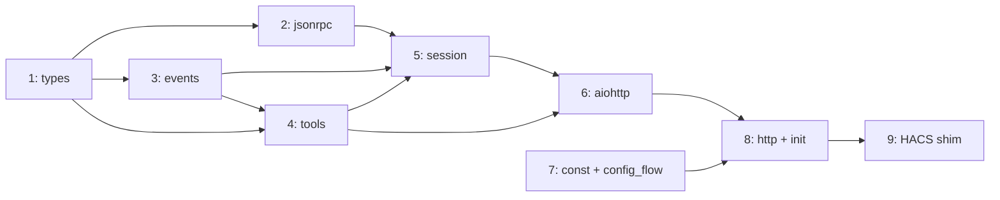
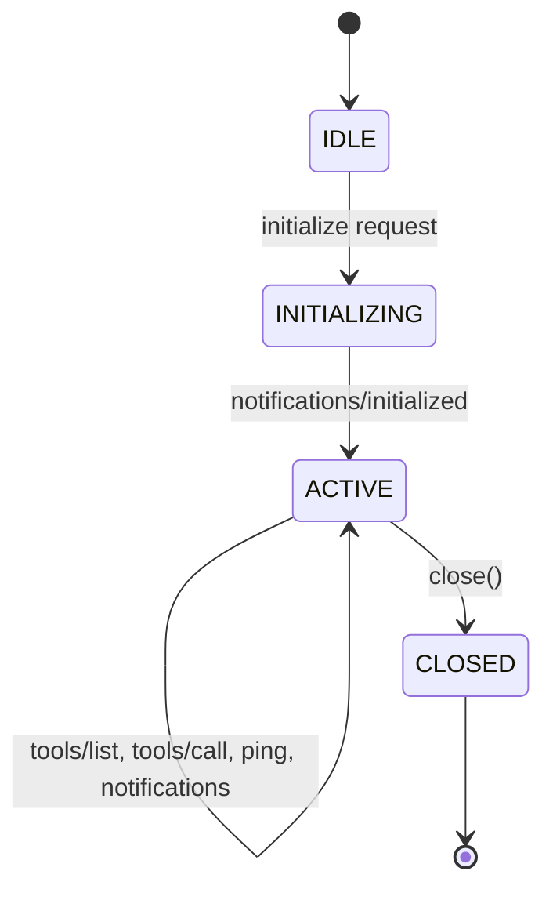

# Implementation Plan

Staged bottom-up implementation following the dependency graph through the
four layers: Core, Integration, Application, Deployment.

## Overview

| Stage | Module(s) | Layer | Deliverable |
| --- | --- | --- | --- |
| **1** | `_core/types.py` | Core | MCP data types, `IncomingRequest` |
| **2** | `_core/jsonrpc.py` | Core | JSON-RPC 2.0 parsing and response building |
| **3** | `_core/events.py` | Core | `SendResponse`/`RunEffects` result types, tool effect/continuation types |
| **4** | `_core/tools.py` | Core | Tool generation, `call_tool()`, `resume()` |
| **5** | `_core/session.py` | Core | `SessionManager` (HTTP-to-protocol pipeline) + `MCPServerSession` state machine |
| **6** | `_io/aiohttp.py` | Integration | Thin aiohttp adapter, `EffectHandler` protocol, effect dispatch loop |
| **7** | `component/const.py`, `component/config_flow.py` | Application | Domain constant, config flow, test infra |
| **8** | `component/http.py`, `component/__init__.py` | Application | HTTP view, effect handler, entry points |
| **9** | `custom_components/hamster/` | Deployment | Activate HACS shim re-exports |

Stages 1--5 are pure Python (no mocks, no event loops).
Stage 6 needs asyncio/aiohttp but no HA.
Stages 7--8 need `pytest-homeassistant-custom-component`.



---

## Stage 1 --- `_core/types.py`

MCP data types.  Frozen dataclasses with no behavior, no I/O, no
serialization logic.

### Types

**`JsonRpcId`** --- type alias `int | float | str | None`.  JSON-RPC
allows integer, number, string, or null request IDs.  Fractional numbers
are discouraged (SHOULD NOT) but valid.  `None` represents a null ID
(used in error responses when the original ID could not be determined).

**`TextContent`** --- frozen dataclass.

| Field | Type |
| --- | --- |
| `text` | `str` |

No `type` field --- `isinstance()` discriminates.
The `"type": "text"` wire-format key is added by `jsonrpc.py`.

**`ImageContent`** --- frozen dataclass.

| Field | Type |
| --- | --- |
| `data` | `str` (base64-encoded) |
| `mime_type` | `str` |

**`Content`** --- type alias `TextContent | ImageContent`.
Intentionally incomplete --- MCP also defines `AudioContent` and
`EmbeddedResource` content types, deferred until needed (see Q014).
The implementation should include a comment on this union noting the
omission.

**`Tool`** --- frozen dataclass.

| Field | Type | Notes |
| --- | --- | --- |
| `name` | `str` | e.g. `hamster_services_search` |
| `description` | `str` | Tool description |
| `input_schema` | `dict[str, object]` | JSON Schema object |

**`CallToolResult`** --- frozen dataclass.

| Field | Type | Default |
| --- | --- | --- |
| `content` | `tuple[Content, ...]` | |
| `is_error` | `bool` | `False` |

`tuple` not `list` --- enforces immutability on a frozen dataclass.

**`ServerInfo`** --- frozen dataclass.

| Field | Type |
| --- | --- |
| `name` | `str` |
| `version` | `str` |

**`ServerCapabilities`** --- frozen dataclass.

| Field | Type | Default |
| --- | --- | --- |
| `tools` | `bool` | `True` |

`tools=True` means "we support tools".
`jsonrpc.py` serializes this to `{"tools": {}}` on the wire.

**`ServiceCallResult`** --- frozen dataclass.
Returned by `EffectHandler.execute_service_call()`, consumed by
`resume()`.

| Field | Type | Default |
| --- | --- | --- |
| `success` | `bool` | |
| `data` | `dict[str, object] \| None` | `None` |
| `error` | `str \| None` | `None` |

**`IncomingRequest`** --- frozen dataclass.
Framework-agnostic representation of an HTTP request.  The transport
extracts these fields from the framework's request object and passes
the struct to the sans-IO core, which handles all validation, parsing,
and routing.

| Field | Type | Notes |
| --- | --- | --- |
| `http_method` | `str` | `"POST"`, `"GET"`, or `"DELETE"` |
| `content_type` | `str \| None` | From `Content-Type` header |
| `accept` | `str \| None` | From `Accept` header |
| `origin` | `str \| None` | From `Origin` header |
| `session_id` | `str \| None` | From `Mcp-Session-Id` header |
| `body` | `bytes` | Raw request body |

### Design decisions

- All frozen dataclasses --- immutable, inspectable, aligned with
  "effects are data" principle.
- Pythonic field names (`input_schema`, `is_error`, `mime_type`) ---
  `jsonrpc.py` handles camelCase conversion for wire format.
- No serialization methods --- wire format conversion lives in
  `jsonrpc.py`.
- `ImageContent` included now --- trivial, avoids a future union change.
- `IncomingRequest` pushes the sans-IO boundary out to raw HTTP data.
  The transport's only async job is reading the request body bytes;
  everything else (header validation, JSON parsing, JSON-RPC parsing,
  session routing, response building) lives in the pure core.

### Tests --- `_tests/test_types.py`

- Construction of each type with valid data.
- Immutability enforcement (assigning to fields raises
  `FrozenInstanceError`).
- `Content` union accepts both `TextContent` and `ImageContent`.
- `CallToolResult` defaults (`is_error=False`).
- `ServiceCallResult` construction for success and error cases.
- `IncomingRequest` construction with all fields.

---

## Stage 2 --- `_core/jsonrpc.py`

JSON-RPC 2.0 message parsing and response building, including MCP type
serialization.

### Parsed message types

**`JsonRpcRequest`** --- frozen dataclass.

| Field | Type |
| --- | --- |
| `id` | `JsonRpcId` |
| `method` | `str` |
| `params` | `dict[str, object]` |

**`JsonRpcNotification`** --- frozen dataclass.

| Field | Type |
| --- | --- |
| `method` | `str` |
| `params` | `dict[str, object]` |

**`JsonRpcResponse`** --- frozen dataclass.
Received when a client sends a JSON-RPC response object (has `result` or
`error` instead of `method`).  Since the server never sends requests to
clients, these are unexpected.  Treated as `INVALID_REQUEST`.

| Field | Type |
| --- | --- |
| `response` | `dict[str, object]` (pre-built JSON-RPC error response) |

**`JsonRpcParseError`** --- frozen dataclass.

| Field | Type |
| --- | --- |
| `response` | `dict[str, object]` (pre-built JSON-RPC error response) |

**`ParsedMessage`** --- type alias
`JsonRpcRequest | JsonRpcNotification | JsonRpcResponse | JsonRpcParseError`.

### Constants

```python
PARSE_ERROR = -32700
INVALID_REQUEST = -32600
METHOD_NOT_FOUND = -32601
INVALID_PARAMS = -32602
INTERNAL_ERROR = -32603

SUPPORTED_VERSIONS: tuple[str, ...] = ("2025-03-26",)
MCP_PROTOCOL_VERSION = SUPPORTED_VERSIONS[0]
```

### Parsing

**`parse_message(raw: dict[str, object]) -> ParsedMessage`**

Parses a single JSON-RPC message object.

Validation rules:

- Has `result` or `error` key (no `method`) --- `JsonRpcResponse`
  (client sent a response object; rejected as `INVALID_REQUEST`).
- `jsonrpc` must be `"2.0"` --- `INVALID_REQUEST` if missing/wrong.
- `method` must be a string --- `INVALID_REQUEST` if missing/wrong type.
- `params` must be a dict if present (MCP uses only object params) ---
  `INVALID_REQUEST` if wrong type; defaults to `{}` if absent.
- `params: null` treated as `{}`.
- Has `id` (int, float, str, or null) --- `JsonRpcRequest`; no `id`
  key --- `JsonRpcNotification`.
- `id` with non-number/non-string type (bool, array, object) ---
  `JsonRpcParseError`.
- Error response `id` is `null` when original ID could not be extracted,
  otherwise carries the extracted ID.

**`parse_batch(body: object) -> list[ParsedMessage] | ParsedMessage`**

Handles the top-level JSON value after `json.loads`:

- If `body` is a dict --- delegate to `parse_message()`, return single
  result.
- If `body` is a list --- empty list is `JsonRpcParseError`
  (`INVALID_REQUEST`).  Non-empty list: call `parse_message()` on each
  element (non-dict elements produce `JsonRpcParseError` per element).
  Return list of results.
- Otherwise (string, number, null, bool) --- `JsonRpcParseError`
  (`INVALID_REQUEST`).

### Response building

**`make_success_response(request_id: JsonRpcId, result: object) -> dict`**
--- `{"jsonrpc": "2.0", "id": ..., "result": ...}`.

**`make_error_response(request_id: JsonRpcId | None, code: int, message: str) -> dict`**
--- `{"jsonrpc": "2.0", "id": ..., "error": {"code": ..., "message": ...}}`.

### MCP type serialization

| Function | Wire format |
| --- | --- |
| `serialize_tool(Tool)` | `{"name": ..., "description": ..., "inputSchema": ...}` |
| `serialize_content(Content)` | `{"type": "text", "text": ...}` or `{"type": "image", "data": ..., "mimeType": ...}` |
| `serialize_call_tool_result(CallToolResult)` | `{"content": [...]}` --- `"isError"` key omitted when false, included when true |
| `serialize_server_info(ServerInfo)` | `{"name": ..., "version": ...}` |
| `serialize_capabilities(ServerCapabilities)` | `{"tools": {}}` when true, `{}` when false |

### MCP response builders

| Function | Purpose |
| --- | --- |
| `build_initialize_response(request_id, server_info, capabilities, protocol_version)` | Full init response with negotiated `protocolVersion` |
| `build_tool_list_response(request_id, tools: Sequence[Tool])` | Response with serialized tool array (no pagination --- all tools in one response; cursor support deferred) |
| `build_tool_result_response(request_id, result: CallToolResult)` | Response with serialized call tool result |

### Tests --- `_tests/test_jsonrpc.py`

**`parse_message` --- single messages:**

- Valid request with id, method, params --- `JsonRpcRequest`.
- Valid notification (no id) --- `JsonRpcNotification`.
- Response object (has `result`, no `method`) --- `JsonRpcResponse`.
- Missing `jsonrpc` / wrong version (`"1.0"`) / missing `method` /
  non-string method / array params / string params / bool id / object id
  / empty dict `{}` --- all `JsonRpcParseError`.
- Missing params defaults to `{}`.
- `params: null` treated as `{}`.
- Extra fields in message (e.g. `"extra": "bar"`) --- parsed
  successfully, extra fields ignored.
- Error response ID is `null` when original could not be extracted.

**`parse_message` --- id edge cases:**

- `id: 0` --- valid `JsonRpcRequest` (falsy but valid).
- `id: ""` --- valid `JsonRpcRequest` (empty string is valid).
- `id: null` --- valid `JsonRpcRequest` with `id=None`.
- `id: 1.5` --- valid `JsonRpcRequest` (fractional discouraged but
  allowed by spec).
- `id: -1` --- valid `JsonRpcRequest`.
- Very large integer --- valid `JsonRpcRequest`.

**`parse_batch` --- batch handling:**

- Single dict --- delegates to `parse_message`, returns single result.
- Array of valid requests --- returns list of `ParsedMessage`.
- Empty array `[]` --- `JsonRpcParseError` (`INVALID_REQUEST`).
- Array with non-dict element --- per-element `JsonRpcParseError`.
- Mixed array (requests + notifications) --- correct types per element.
- Non-dict non-array body (string, number, null, bool) ---
  `JsonRpcParseError`.

**Serialization:**

- `TextContent` --- `{"type": "text", "text": "..."}`.
- `ImageContent` --- `{"type": "image", "data": "...", "mimeType": "..."}`.
- `Tool` --- camelCase `inputSchema`.
- `CallToolResult(is_error=False)` --- `isError` key absent.
- `CallToolResult(is_error=True)` --- `"isError": true`.
- `ServerCapabilities(tools=True)` --- `{"tools": {}}`.
- `ServerCapabilities(tools=False)` --- `{}`.

**MCP response builders:**

- Initialize response has `protocolVersion`, `capabilities`,
  `serverInfo`.
- Tool list response has `tools` array.
- Tool result response wraps `CallToolResult` correctly.

---

## Stage 3 --- `_core/events.py`

Protocol events and tool effect/continuation types.  These discriminated
unions drive the entire system.

### Group 1 --- Tool effect/continuation types

Used by `tools.py` --- `call_tool()` produces a `ToolEffect`, `resume()`
takes a `Continuation` and I/O result and produces the next `ToolEffect`.

**`FormatServiceResponse`** --- frozen dataclass, no fields.
Format the raw HA service response into MCP content.

**`Continuation`** --- type alias `FormatServiceResponse`.
Union grows as new continuation types are added.

**`Done`** --- frozen dataclass.

| Field | Type |
| --- | --- |
| `result` | `CallToolResult` |

**`ServiceCall`** --- frozen dataclass.

| Field | Type |
| --- | --- |
| `domain` | `str` |
| `service` | `str` |
| `target` | `dict[str, object] \| None` |
| `data` | `dict[str, object]` |
| `continuation` | `Continuation` |

**`ToolEffect`** --- type alias `Done | ServiceCall`.

### Group 2 --- Request result types

Returned by `SessionManager.receive_request()`.  The transport does
`match`/`case` on these.  These tell the transport **what to do**, not
what happened --- the transport's match/case is trivial.

**`SendResponse`** --- frozen dataclass.

| Field | Type | Notes |
| --- | --- | --- |
| `status` | `int` | HTTP status code |
| `headers` | `dict[str, str]` | Response headers (e.g. `Mcp-Session-Id`, `Content-Type`) |
| `body` | `dict[str, object] \| None` | JSON-serializable body, or `None` for no-body responses |

Covers all non-effect responses: initialization (200 + `Mcp-Session-Id`
header), notification acknowledgment (202, no body), tool list (200),
HTTP-level errors (405 for unsupported GET/SSE, 406, 415, 503 for
unloaded), and JSON-RPC / protocol errors (400/404).

**`RunEffects`** --- frozen dataclass.

| Field | Type |
| --- | --- |
| `request_id` | `JsonRpcId` |
| `effect` | `ToolEffect` |

Returned for `tools/call`.  The transport runs the effect dispatch loop,
then calls `manager.build_effect_response(request_id, result)` to get a
`SendResponse`.

**`ReceiveResult`** --- type alias `SendResponse | RunEffects`.

### Group 3 --- Session lifecycle events

**`SessionExpired`** --- frozen dataclass.

| Field | Type |
| --- | --- |
| `session_id` | `str` |

### Definition order

`FormatServiceResponse` -> `Continuation` -> `Done`, `ServiceCall` ->
`ToolEffect` -> `SendResponse`, `RunEffects` -> `ReceiveResult` ->
`SessionExpired`.  Avoids forward references at runtime.

### Tests --- `_tests/test_events.py`

- Construction of each dataclass with required fields.
- Type union membership (`isinstance` checks).
- Pattern matching on `ReceiveResult` covering `SendResponse` and
  `RunEffects`.
- Pattern matching on `ToolEffect` covering `Done` and `ServiceCall`.
- Nested dispatch: extract `effect` from `RunEffects`, match on it.
- `SendResponse` with `body=None` (e.g. 202) vs with body (e.g. 200).
- Frozen enforcement.

---

## Stage 4 --- `_core/tools.py`

Meta-tool definitions, `ServiceIndex`, `call_tool()`, and `resume()`.
Uses the "meta-tool" pattern (modeled after onshape-mcp): instead of
generating one MCP tool per HA service, 4 fixed tools let the LLM
discover and invoke any HA service dynamically (see D017).

### Fixed tool definitions

```python
TOOLS: tuple[Tool, ...] = (...)   # 4 constant Tool objects
```

| Tool name | Description |
| --- | --- |
| `hamster_services_search` | Find HA services by keyword, optionally filtered by domain |
| `hamster_services_explain` | Get full field/target/selector details for a specific service |
| `hamster_services_call` | Invoke a service with separate target and data parameters |
| `hamster_services_schema` | Describe what a selector type expects as input |

Input schemas:

**`hamster_services_search`:**

| Property | Type | Required |
| --- | --- | --- |
| `query` | `string` | yes |
| `domain` | `string` | no |

**`hamster_services_explain`:**

| Property | Type | Required |
| --- | --- | --- |
| `domain` | `string` | yes |
| `service` | `string` | yes |

**`hamster_services_call`:**

| Property | Type | Required |
| --- | --- | --- |
| `domain` | `string` | yes |
| `service` | `string` | yes |
| `target` | `object` (keys: `entity_id`, `device_id`, `area_id`, `floor_id`, `label_id` --- each `array` of `string`) | no |
| `data` | `object` | no |

**`hamster_services_schema`:**

| Property | Type | Required |
| --- | --- | --- |
| `selector_type` | `string` | yes |

### ServiceIndex

Searchable index of HA service descriptions.  Built from the output of
`homeassistant.helpers.service.async_get_all_descriptions()`.

```python
class ServiceIndex:
    def __init__(
        self,
        descriptions: dict[str, dict[str, object]],
    ) -> None: ...

    def search(
        self,
        query: str,
        *,
        domain: str | None = None,
    ) -> str: ...

    def explain(self, domain: str, service: str) -> str | None: ...
```

**Constructor:** iterates the descriptions dict (keyed by domain, then
service name).  Builds an internal list of entries with pre-computed
search text (domain, service name, description, field names
concatenated, lowercased).

**`search()`:** case-insensitive substring matching against the
pre-computed search text.  If `domain` is provided, only entries in that
domain are searched.  Returns a formatted text summary of matching
services (domain, service name, description, whether it has a target).
Returns a "no results" message if nothing matches.

**`explain()`:** looks up a single service by domain and service name.
Returns the raw HA service description as formatted text: name,
description, target config (if any), and all fields with their selectors
as HA defines them (no translation).  Returns `None` if the service is
not found.

### Selector descriptions

```python
SELECTOR_DESCRIPTIONS: dict[str, str] = { ... }
```

Static mapping of selector type name to a human-readable description of
the expected input format.  Used by `hamster_services_schema`.

Examples:

| Selector type | Description (summary) |
| --- | --- |
| `boolean` | `true` or `false` |
| `text` | String value |
| `number` | Numeric value; may have min/max/step constraints |
| `select` | One of a fixed set of string options |
| `duration` | Dict with optional keys: `days`, `hours`, `minutes`, `seconds`, `milliseconds` (all numbers) |
| `color_rgb` | Array of 3 integers `[R, G, B]`, each 0--255 |
| `entity` | Entity ID string (e.g. `light.living_room`) |
| `target` | Dict with optional keys: `entity_id`, `device_id`, `area_id`, `floor_id`, `label_id` |
| `location` | Dict with `latitude`, `longitude` (required), `radius` (optional) |
| `object` | Arbitrary JSON object |
| Unknown | Description noting the selector type is unrecognized |

The full table covers all 40 registered HA selector types.

```python
def describe_selector(selector_type: str) -> str: ...
```

Looks up the selector type in `SELECTOR_DESCRIPTIONS`.  Returns the
description string, or a fallback message for unknown types.

### Tool dispatch

```python
def call_tool(
    name: str,
    arguments: dict[str, object],
    index: ServiceIndex,
) -> ToolEffect:
```

Dispatches by tool name:

- `hamster_services_search` --- calls `index.search()`, returns `Done`
  with text result.
- `hamster_services_explain` --- calls `index.explain()`, returns `Done`.
  Returns error content if service not found.
- `hamster_services_call` --- validates that the domain/service exists
  in the index (see D017).  If not found, returns
  `Done(CallToolResult(is_error=True))`.  If found, returns
  `ServiceCall(domain, service, target, data, FormatServiceResponse())`.
- `hamster_services_schema` --- calls `describe_selector()`, returns
  `Done`.
- Unknown name --- raises `ValueError`.

Three of the four tools return `Done` immediately (pure computation).
Only `hamster_services_call` produces a `ServiceCall` effect requiring
I/O.

### Continuation

```python
def resume(continuation: Continuation, io_result: ServiceCallResult) -> ToolEffect:
```

`FormatServiceResponse` + `ServiceCallResult` ->
`Done(CallToolResult(...))`.  Formats success as JSON, formats error with
message and `is_error=True`.

### Tests --- `_tests/test_tools.py`

**Tool definitions:**

- `TOOLS` has exactly 4 entries.
- Each tool has a non-empty `name`, `description`, and valid
  `input_schema`.
- Tool names match `[a-zA-Z0-9_-]{1,64}`.

**ServiceIndex construction:**

- Empty descriptions dict -> empty index.
- Single domain/service -> searchable.
- Multiple domains -> all indexed.

**`search()`:**

- Keyword match on service name -> found.
- Keyword match on description -> found.
- Keyword match on field names -> found.
- Case-insensitive matching.
- Domain filter restricts results.
- No match -> "no results" message.

**`explain()`:**

- Known service -> raw HA description with fields, selectors, target.
- Unknown service -> `None`.
- Service with sections (nested field groups) -> fields shown flattened.

**Selector descriptions:**

- Each known selector type returns a non-empty description.
- Unknown selector -> fallback message.

**`call_tool()`:**

- `hamster_services_search` -> `Done` with text content.
- `hamster_services_explain` -> `Done` with text content.
- `hamster_services_explain` for unknown service -> `Done` with
  `is_error=True`.
- `hamster_services_call` with valid service -> `ServiceCall` with
  correct domain, service, target, data.
- `hamster_services_call` with unknown service -> `Done` with
  `is_error=True`.
- `hamster_services_schema` -> `Done` with selector description.
- Unknown tool name -> `ValueError`.

**`resume()`:**

- Success with data -> `Done` with JSON text.
- Success without data -> `Done` with success message.
- Error -> `Done` with `is_error=True`.

---

## Stage 5 --- `_core/session.py`

Session manager and per-session state machine.  The `SessionManager` is
the single entry point for the sans-IO core: it receives raw HTTP
request data (`IncomingRequest`) and returns a complete response
instruction (`ReceiveResult`).  Header validation, JSON parsing,
JSON-RPC parsing, session routing, and response building all live here.

### `MCPServerSession`

Per-session state machine.  Internal to the core --- not called directly
by the transport.  Only `SessionManager` interacts with sessions.



#### Internal result types

The session returns internal result types that the manager wraps into
`SendResponse` / `RunEffects` with appropriate HTTP status and headers.

**`SessionResponse`** --- frozen dataclass.

| Field | Type |
| --- | --- |
| `body` | `dict[str, object]` |

A JSON-RPC response body to send to the client.

**`SessionAck`** --- frozen dataclass, no fields.

A notification was processed.  Manager wraps as `SendResponse(202)`.

**`SessionToolCall`** --- frozen dataclass.

| Field | Type |
| --- | --- |
| `request_id` | `JsonRpcId` |
| `effect` | `ToolEffect` |

A tool call needs effect dispatch.  Manager wraps as `RunEffects`.

**`SessionError`** --- frozen dataclass.

| Field | Type |
| --- | --- |
| `code` | `int` |
| `message` | `str` |
| `request_id` | `JsonRpcId \| None` |

A JSON-RPC error.  Manager builds the error response and wraps as
`SendResponse(200)`.

**`SessionResult`** --- type alias
`SessionResponse | SessionAck | SessionToolCall | SessionError`.

#### API

```python
class MCPServerSession:
    def handle(
        self,
        message: JsonRpcRequest | JsonRpcNotification,
        index: ServiceIndex,
    ) -> SessionResult: ...
```

`handle()` is the single entry point.  The manager calls it after
parsing and routing, passing the current `ServiceIndex`.  The session
dispatches based on its current state and the message's method.  For
`tools/call`, the session passes the index through to `call_tool()`.

#### State routing

| State | Method | Result |
| --- | --- | --- |
| IDLE | `initialize` | -> INITIALIZING, `SessionResponse` with init body |
| IDLE | `ping` | `SessionResponse` with `{"result": {}}` |
| IDLE | anything else | `SessionError` (`INVALID_REQUEST`) |
| INITIALIZING | `notifications/initialized` | -> ACTIVE, `SessionAck` |
| INITIALIZING | `ping` | `SessionResponse` with `{"result": {}}` |
| INITIALIZING | anything else | `SessionError` (`INVALID_REQUEST`) |
| ACTIVE | `ping` | `SessionResponse` with `{"result": {}}` |
| ACTIVE | `tools/list` | `SessionResponse` with tool list body |
| ACTIVE | `tools/call` (valid tool name) | `SessionToolCall` with effect (index passed to `call_tool()`) |
| ACTIVE | `tools/call` (unknown tool name) | `SessionError` (`INVALID_PARAMS`) |
| ACTIVE | any notification | `SessionAck` |
| ACTIVE | unknown method request | `SessionError` (`METHOD_NOT_FOUND`) |
| CLOSED | anything | `SessionError` (`INVALID_REQUEST`) |

#### Version negotiation

On `initialize`, the session extracts `params["protocolVersion"]` from
the request.  If missing, returns `SessionError` (`INVALID_PARAMS`,
`"Missing protocolVersion"`).  The session checks the requested version
against `SUPPORTED_VERSIONS`:

- If found --- respond with that version.
- If not found --- respond with `MCP_PROTOCOL_VERSION` (the server's
  preferred version).  The client decides whether to continue.

The negotiated version is stored on the session (for future use) and
passed to `build_initialize_response()`.

### `SessionManager`

Multi-session container and HTTP-to-protocol pipeline.

```python
class SessionManager:
    def __init__(
        self,
        server_info: ServerInfo,
        idle_timeout: float = 1800.0,
        session_id_factory: Callable[[], str] = ...,
        debounce_delay: float = 0.5,
    ): ...
```

Default `session_id_factory` is `secrets.token_hex` (produces
cryptographically random hex strings).  Tests inject a deterministic
factory.

Sessions are stored internally as `dict[str, MCPServerSession]` keyed
by session ID, with a parallel `dict[str, float]` for last-activity
timestamps.  The manager also holds a `ServiceIndex` (updated via
`update_index()`) and the constant `TOOLS` tuple from `tools.py`.

`SessionManager` is designed for single-event-loop concurrency.
Multiple coroutines may call `receive_request()` concurrently (asyncio
cooperative scheduling), but no thread safety is required.

**`WakeupToken`** --- type alias `object`.  Opaque token returned by
the core in `WakeupRequest`.  The I/O layer hands it back to the core
on wakeup without interpreting it.

**`WakeupRequest`** --- frozen dataclass.

| Field | Type |
| --- | --- |
| `deadline` | `float` |
| `token` | `WakeupToken` |

| Method | Signature | Purpose |
| --- | --- | --- |
| `update_index` | `(index: ServiceIndex) -> None` | Replace service index (tool list is constant; see D017) |
| `receive_request` | `(request: IncomingRequest, now: float) -> ReceiveResult \| list[ReceiveResult]` | Full HTTP-to-protocol pipeline; returns list for batch requests |
| `build_effect_response` | `(request_id: JsonRpcId, result: CallToolResult) -> SendResponse` | Build HTTP response after effect dispatch completes (session-independent) |
| `notify_services_changed` | `(now: float) -> None` | Record that services changed; starts debounce timer |
| `check_wakeups` | `(now: float) -> tuple[list[SessionExpired], bool, WakeupRequest \| None]` | Expire idle sessions, check index regeneration debounce, compute next wakeup |
| `handle_wakeup` | `(token: WakeupToken, now: float) -> None` | Core receives its own token back on wakeup (reserved for future use) |
| `close_session` | `(session_id: str) -> bool` | Explicitly close a session |

**`receive_request()` logic:**

1. Check `http_method`:
    - `GET` -> `SendResponse(405)`.  Intentionally unsupported in v1;
      GET becomes the SSE endpoint when streaming is added (see Q012).
    - `DELETE` -> extract session ID, close session,
      `SendResponse(200)` or `SendResponse(404)`.
    - `POST` -> continue below.
2. Validate `Content-Type` media type -> `SendResponse(415)` if not
   `application/json`.  Parameters (e.g. `; charset=utf-8`) are
   ignored; only the media type portion is checked.
3. Validate `Accept` header -> `SendResponse(406)` if not compatible
   with `application/json`.  Accepts `application/json`,
   `application/*`, and `*/*` (see Q011).
4. Validate `Origin` header -> deferred (see Q010).  Currently a
   no-op placeholder.
5. Parse JSON body (`json.loads`) -> `SendResponse(400)` with
   `PARSE_ERROR` on failure.
6. `parse_batch(body)` (JSON-RPC validation):
    - Single message: process as before.
    - Batch (list): process each message, collect results.  Omit
      responses for notifications.  If all messages are notifications,
      return `SendResponse(202)`.  Otherwise return list of response
      bodies as a JSON array.
    - `JsonRpcParseError` / `JsonRpcResponse` -> `SendResponse(400)`.
7. Route by `request.session_id`:
    - `None` + `initialize` -> create session via factory, delegate.
      `initialize` MUST NOT appear in a batch.
    - `None` + anything else -> `SendResponse(400)`.
    - Unknown session ID -> `SendResponse(404)`.
    - Known session ID -> update last-activity, delegate to session.
8. Wrap `SessionResult` into `SendResponse` or `RunEffects` with
   appropriate status, headers (`Content-Type`, `Mcp-Session-Id`), and
   body.

**`build_effect_response()`:**

Session-independent.  Takes a `request_id` and `CallToolResult`, builds
the JSON-RPC response using `build_tool_result_response()`, and wraps in
`SendResponse(200)`.  Can be called even if the session has expired or
been closed --- the response is built without consulting session state.
The transport holds the session ID from the original request and includes
it in response headers.

**`check_wakeups()` logic:**

- Expire sessions where `now - last_activity >= idle_timeout`.
- Remove expired sessions from internal storage.
- Check if index regeneration debounce deadline has passed.
- Return `(expired_list, should_regenerate_index, next_wakeup)`.
- `next_wakeup` is `None` if no sessions and no pending debounce.

The I/O layer sleeps until the `WakeupRequest.deadline`, then calls
`check_wakeups()`.  When `should_regenerate_index` is `True`, the
component calls `async_get_all_descriptions()`, builds a new
`ServiceIndex`, and calls `update_index()`.  The generic
`WakeupRequest` / `WakeupToken` mechanism allows future wakeup reasons
without changing the I/O layer.

### Tests --- `_tests/test_session.py`

All tests use `IncomingRequest` values directly --- no HTTP framework,
no mocks.  The entire protocol is testable with plain data.

**Happy path:**

- Full flow: init -> ack -> tools/list -> tools/call (as raw
  `IncomingRequest` values with JSON bytes).

**HTTP-level validation:**

- Wrong `Content-Type` -> `SendResponse(415)`.
- `Content-Type` with parameters (e.g. `application/json; charset=utf-8`)
  -> accepted.
- Missing `Accept` -> `SendResponse(406)`.
- `Accept: */*` -> accepted.
- `Accept: application/*` -> accepted.
- Malformed JSON body -> `SendResponse(400)` with `PARSE_ERROR`.
- Empty body `b""` -> `SendResponse(400)` with `PARSE_ERROR`.
- Valid JSON that's not an object or array (e.g. `b'"hello"'`, `b"42"`)
  -> `SendResponse(400)` with `INVALID_REQUEST`.
- `GET` request -> `SendResponse(405)`.
- `DELETE` with valid session -> `SendResponse(200)`.
- `DELETE` with unknown session -> `SendResponse(404)`.
- `DELETE` with no session ID -> `SendResponse(400)`.

**Batch requests:**

- Array of two requests -> list of two responses.
- Array with mix of requests and notifications -> responses for requests
  only (notifications omitted).
- Array of only notifications -> `SendResponse(202)`.
- Empty array -> `SendResponse(400)` with `INVALID_REQUEST`.
- `initialize` in batch -> `SendResponse(400)`.

**State machine:**

- tools/list before init -> error response.
- initialize when active -> error response.
- Request to closed session -> error response.
- `ping` in IDLE -> success response `{"result": {}}`.
- `ping` in INITIALIZING -> success response `{"result": {}}`.
- `ping` in ACTIVE -> success response `{"result": {}}`.
- `ping` in CLOSED -> error response.

**Version negotiation:**

- `initialize` with matching `protocolVersion` -> response echoes same
  version.
- `initialize` with unknown `protocolVersion` -> response contains
  server's preferred version.
- `initialize` without `protocolVersion` -> error (`INVALID_PARAMS`).

**Routing:**

- No session ID + init -> creates session, `SendResponse(200)` with
  `Mcp-Session-Id` header.
- No session ID + non-init -> `SendResponse(400)`.
- Unknown session ID -> `SendResponse(404)`.
- Multiple independent sessions operate without interference.

**Index and tool management:**

- `update_index()` replaces the service index.
- `tools/list` always returns the 4 fixed tools from `TOOLS`.
- Unknown tool name -> error response with `INVALID_PARAMS`.

**Effect response:**

- `build_effect_response()` produces `SendResponse(200)` with
  serialized `CallToolResult`.
- `build_effect_response()` succeeds even after session has expired
  (session-independent).

**Wakeups:**

- No sessions, no pending debounce -> `([], False, None)`.
- Within timeout -> not expired.
- Past timeout -> `SessionExpired`, session removed.
- Activity push-back resets timeout.
- Multiple sessions -> correct next wakeup.
- `notify_services_changed()` -> `should_regenerate_index` becomes
  `True` after debounce delay.
- Rapid successive `notify_services_changed()` calls -> debounce resets,
  only one regeneration.

**Concurrency:**

- `receive_request()` returns `RunEffects`, then another
  `receive_request()` on same session before `build_effect_response()`
  -> both succeed (session doesn't track in-flight requests).

**Deterministic testing:**

- Injected `session_id_factory` -> predictable IDs.
- Injected `now` -> deterministic timeouts and debounce.

---

## Stage 6 --- `_io/aiohttp.py`

Thin aiohttp adapter.  Bridges aiohttp request objects to the sans-IO
core's `IncomingRequest` / `ReceiveResult` interface.  Uses asyncio and
aiohttp.  Does **not** import `homeassistant`.

The transport performs only two kinds of work:

1. **Data extraction** --- read bytes, extract header strings, build
   `IncomingRequest`, translate `SendResponse` to `web.Response`.
2. **Effect dispatch** --- the one async loop that executes I/O effects.

All validation, parsing, routing, and response building live in the
sans-IO core (Stage 5).

### `EffectHandler` protocol

```python
class EffectHandler(Protocol):
    async def execute_service_call(
        self,
        domain: str,
        service: str,
        target: dict[str, object] | None,
        data: dict[str, object],
    ) -> ServiceCallResult: ...
```

Defined here, implemented by `hamster.component.http`.

### `AiohttpMCPTransport`

```python
class AiohttpMCPTransport:
    def __init__(
        self, manager: SessionManager, effect_handler: EffectHandler,
    ) -> None: ...
```

**Loaded flag:**

The transport has a `_loaded: bool` flag, initially `True`.  On entry
unload, call `transport.shutdown()` which sets `_loaded = False`.
`handle()` checks this flag first and returns `web.Response(status=503)`
(Service Unavailable) when unloaded.  This is necessary because
`HomeAssistantView` routes cannot be unregistered from HA's HTTP server.

**Single HTTP handler for all methods:**

```python
async def handle(self, request: web.Request) -> web.Response:
    if not self._loaded:
        return web.Response(status=503)
    body = await request.read()
    incoming = IncomingRequest(
        http_method=request.method,
        content_type=request.content_type,
        accept=request.headers.get("Accept"),
        origin=request.headers.get("Origin"),
        session_id=request.headers.get("Mcp-Session-Id"),
        body=body,
    )
    result = self._manager.receive_request(incoming, now=time.monotonic())
    match result:
        case SendResponse(status=s, headers=h, body=b):
            if b is None:
                return web.Response(status=s, headers=h)
            return web.json_response(data=b, status=s, headers=h)
        case RunEffects(request_id=rid, effect=effect):
            call_result = await self._run_effects(effect)
            resp = self._manager.build_effect_response(rid, call_result)
            return web.json_response(
                data=resp.body, status=resp.status, headers=resp.headers)
        case list() as batch_results:
            # Batch response: collect response bodies into JSON array
            ...
```

### Effect dispatch loop

```python
async def _run_effects(self, effect: ToolEffect) -> CallToolResult:
    current = effect
    while True:
        match current:
            case Done(result=result):
                return result
            case ServiceCall(domain=d, service=s, target=t,
                           data=data, continuation=cont):
                io_result = await self._effect_handler.execute_service_call(
                    d, s, t, data)
                current = resume(cont, io_result)
```

### Wakeup loop

Single background `asyncio.Task` that manages all timed events.

- Calls `manager.check_wakeups(now)` to get expired sessions,
  tool-regeneration flag, and next `WakeupRequest`.
- For each `SessionExpired`: logs and cleans up.
- If `should_regenerate_index`: calls back to the component to
  rebuild the service index (via a callback passed at construction).
- If `WakeupRequest` is `None`: waits on `asyncio.Event` (no sessions,
  no pending debounce).
- Otherwise: sleeps until `wakeup.deadline`.
- `notify_activity()` sets the event to wake the loop early (called
  after `receive_request()` creates a new session or after
  `notify_services_changed()`).

### Tests --- `_tests/test_aiohttp.py`

Tests use `aiohttp.test_utils.TestClient` --- full HTTP round-trips, no
HA dependency.

**Fixtures:** `SessionManager` with deterministic factory,
`MockEffectHandler`, `AiohttpMCPTransport`, aiohttp `TestClient`.

Note: most protocol behavior (header validation, JSON parsing, session
routing, error responses) is already covered by Stage 5's pure tests.
Stage 6 tests focus on what the transport adds: I/O integration and
effect dispatch.

- Complete flow through HTTP: init -> ack -> tools/list -> tools/call
  -> response.
- `IncomingRequest` construction: verify the transport correctly
  extracts headers and body from aiohttp requests.  Note: aiohttp's
  `request.content_type` strips parameters (returns `"application/json"`
  even if header was `application/json; charset=utf-8`).
- Effect dispatch: `Done` returns immediately, `ServiceCall` calls
  handler then resumes.
- Effect handler exception: uncaught error produces a proper error
  response, not an opaque 500.
- Loaded flag: requests after `shutdown()` -> 503.
- Wakeup loop: sleeps, wakes on new session, wakes on
  `notify_activity()`, expires idle sessions, triggers index
  rebuild callback after debounce.

---

## Stage 7 --- `component/const.py` & `component/config_flow.py`

HA integration constants and config flow.  First HA-dependent code.

### `component/const.py`

```python
DOMAIN = "hamster"
DEFAULT_IDLE_TIMEOUT: float = 1800.0
```

### `component/config_flow.py`

Minimal setup flow for `single_config_entry` with no user input fields:

```python
class HamsterConfigFlow(ConfigFlow, domain=DOMAIN):
    VERSION = 1

    async def async_step_user(self, user_input=None):
        if user_input is not None:
            return self.async_create_entry(title="Hamster MCP", data={})
        return self.async_show_form(step_id="user")
```

Options flow (tristate control) is deferred pending Q005 resolution.

### New dependency

Add `pytest-homeassistant-custom-component` as a separate extras group
in `pyproject.toml`:

```toml
[project.optional-dependencies]
component-test = ["pytest-homeassistant-custom-component"]
```

### Tests --- `component/_tests/test_config_flow.py`

- Setup flow: show form -> submit -> entry created.
- Correct domain and title.
- `single_config_entry` abort on second attempt.

---

## Stage 8 --- `component/http.py` & `component/__init__.py`

HA integration wiring.  Connects the transport to HA's HTTP server,
service registry, and event bus.

### `component/http.py`

**`HamsterEffectHandler`** --- implements `EffectHandler`:

```python
async def execute_service_call(self, domain, service, target, data):
    try:
        result = await self._hass.services.async_call(
            domain, service, data,
            target=target,
            blocking=True, return_response=True)
        return ServiceCallResult(success=True, data=result or None)
    except ServiceNotFound:
        return ServiceCallResult(success=False,
            error=f"Service not found: {domain}.{service}")
    except ServiceValidationError as err:
        return ServiceCallResult(success=False,
            error=f"Validation error: {err}")
    except HomeAssistantError as err:
        return ServiceCallResult(success=False,
            error=f"Home Assistant error: {err}")
    except Exception as err:
        _LOGGER.exception("Unexpected error executing %s.%s", domain, service)
        return ServiceCallResult(success=False,
            error=f"Unexpected error: {type(err).__name__}: {err}")
```

Resolves Q006 --- catch known HA exception types, format human-readable
messages for the LLM.  The catch-all `except Exception` logs the full
traceback for the operator while returning a formatted message to the
LLM.  `asyncio.CancelledError` is not caught (it's a `BaseException`
subclass in Python 3.9+) and propagates correctly for task cancellation.

**`HamsterMCPView`** --- `HomeAssistantView` subclass:

```python
class HamsterMCPView(HomeAssistantView):
    url = "/api/hamster"
    name = "api:hamster"
    requires_auth = True

    async def post(self, request):
        return await self._transport.handle(request)

    async def get(self, request):
        return await self._transport.handle(request)

    async def delete(self, request):
        return await self._transport.handle(request)
```

`HomeAssistantView` expects separate `get()`, `post()`, `delete()`
methods.  Each delegates to the transport's single `handle()` method.
Auth handled by `requires_auth = True`.  The view holds a reference to
the `AiohttpMCPTransport` instance.

### `component/__init__.py`

**`async_setup_entry()`:**

1. Create `ServerInfo(name="hamster", version=...)` where version comes
   from `importlib.metadata.version("hamster")`.
2. Create `SessionManager`, `HamsterEffectHandler(hass)`,
   `AiohttpMCPTransport(manager, effect_handler)`.
3. Register `HamsterMCPView(transport)` via
   `hass.http.register_view()`.
4. Build initial service index from
   `async_get_all_descriptions(hass)` (see D017).  Call
   `manager.update_index(ServiceIndex(descriptions))`.
5. Listen for `EVENT_SERVICE_REGISTERED` / `EVENT_SERVICE_REMOVED`.
   On each event, call `manager.notify_services_changed(now)`.  The
   wakeup loop handles debouncing and triggers regeneration via a
   callback.  Pass the `async_listen()` unsub callbacks to
   `entry.async_on_unload()`.
6. Start wakeup loop as background task via
   `entry.async_create_background_task()`.  The loop calls
   `manager.check_wakeups()` and invokes an index-rebuild callback
   (which calls `async_get_all_descriptions()` +
   `ServiceIndex(descriptions)` + `manager.update_index()`).
7. Store `manager`, `transport`, and the background task in
   `hass.data[DOMAIN][entry.entry_id]`.

**`async_unload_entry()`:**

1. Call `transport.shutdown()` (sets loaded flag to `False`; new
   requests return 503; in-flight requests complete naturally).
2. Cancel wakeup background task (awaited, not fire-and-forget).
3. Remove `hass.data[DOMAIN][entry.entry_id]`.
   Event listener unsubs are handled automatically by
   `entry.async_on_unload()` callbacks registered during setup.

### Tests --- `component/_tests/`

**`test_init.py`:**

- `async_setup_entry` succeeds.
- Endpoint reachable after setup.
- Tool list returns the 4 fixed tools.
- Service index built from descriptions.
- `async_unload_entry` succeeds.
- Service events trigger index rebuild.

**`test_http.py`:**

- Full MCP flow through HA: init -> ack -> tools/list -> tools/call.
- Unauthenticated request -> 401.

**`test_effect_handler.py`:**

- Successful service call -> `ServiceCallResult(success=True)`.
- `ServiceNotFound` / `ServiceValidationError` / `HomeAssistantError`
  -> appropriate error results.
- Generic `Exception` -> `ServiceCallResult(success=False)` with
  formatted error message; exception logged.

---

## Stage 9 --- `custom_components/hamster/` shim activation

Activate the HACS deployment shim re-exports.

### Changes

**`custom_components/hamster/__init__.py`** --- uncomment:

```python
from hamster.component import async_setup_entry, async_unload_entry
```

Note: the existing shim comment also includes `async_setup`, which is
intentionally **not** re-exported.  The integration is config-entry-only
(`single_config_entry: true` in `manifest.json`), so HA uses
`async_setup_entry`, not `async_setup`.  Trim the commented block to
match.

**`custom_components/hamster/config_flow.py`** --- uncomment:

```python
from hamster.component.config_flow import HamsterConfigFlow as ConfigFlow
```

### Verification

- Hassfest validation (already in CI).
- HACS validation (already in CI).
- `manifest.json` `requirements` version matches `pyproject.toml`.
